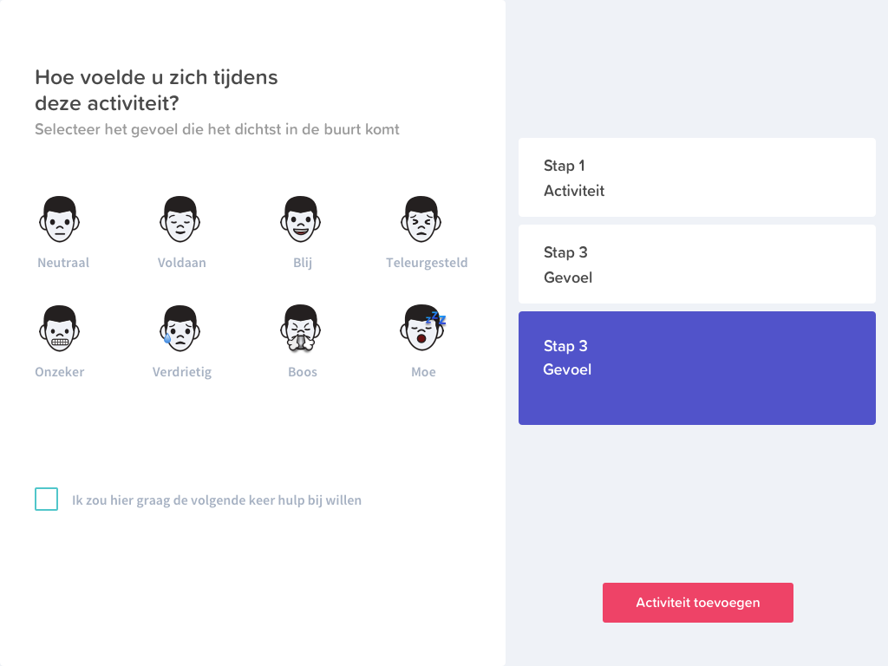

# Ontwerp

In het Hi-Fi prototype 1.0 hebben we rekening gehouden met [**design voor ouderen**](../../analyse/onderzoeksvragen/oudere-vriendelijke-ui.md). We hebben uitgebreid [**onderzoek**](../../analyse/onderzoeksvragen/oudere-vriendelijke-ui.md) gedaan naar kleuren, vormen en typografie voor ouderen. Dit hebben we toegepast in onze eerste versie van het visual design. 

> [https://xd.adobe.com/view/fd30771f-f6d3-4c39-a78b-f87b802c0a4d-a863/](https://xd.adobe.com/view/fd30771f-f6d3-4c39-a78b-f87b802c0a4d-a863/)

## **2.0 Home**

Dit is het home scherm voor de gebruikers. Hier kunnen ze in één oogopslag zien wat hun dagelijkse beweging en gevarenzones zijn. Ook kunnen ze hier als primaire actie een activiteit toevoegen. Het is de bedoeling dat ze hun beweging toevoegen als ze deze hebben afgerond zodat ze in het overzicht op de homepagina kunnen zien hoelaat ze het hebben gedaan, wat ze hebben gedaan, hoelang, hoe ze zich voelde en of ze hulp wilden. 

## 2.1 Gevarenzones

Bij de gevarenzones kan de gebruiker zien welke delen van zijn/haar lichaam gevaar lopen en dus risico lopen op functieverlies. Onderaan staan suggesties wat hij/zij daar tegen zou kunnnen doen. De gebruiker moet deze activiteiten wel nog zelf gaan doen en word dus niet gedwongen tot een activiteit. De gebruiker komt ook op deze tab als hij/zij op een van de gevaren driehoekjes rechts klikt, dan opent de gevaren zone tab. 

## 3.0 Gegevens

Op deze pagina kan de gebruiker zijn/haar gegevens aanpassen. Het gaat hier vooral om het aantal keer melding per dag. De gebruiker kan namelijk meldingen ontvangen als zij/hij nog geen activiteiten heeft ingevuld op het aangegeven tijdstip \(meerdere keren per dag of 1 keer per dag\). Ook kunnen hier de gegevens worden gewijzigd. 

## 3.1 Gegevens bewerken

Als de gebruiker op "bewerk gegevens" heeft geklikt dan kan hij/zij de gegevens aanpassen in de invul velden. Met de radio buttons kan er gekozen worden voor de hoeveelheid meldingen als de gebruiker vergeet de activiteiten in te vullen. 

## 4.0 Activiteit toevoegen

## 4.1 Activiteit toevoegen

## 5.0 Activiteit geselecteerd

## 5.1 Activiteit toegevoegd

## 6.0 Tijd

## 7.0 Gevoel

## 8.0 Goevoel geselecteerd 

## 9.0 Hulp gevraagd

## 10.0 Activiteit toegevoegd

Het bevestigings scherm dat een activiteit daadwerkelijk is toegevoegd aan de dagelijkse beweging van de gebruiker. 

## 11.0 Home verzorger

Hier kunnen de familie, vrienden of mantelzorgers de activiteiten van de gebruiker zien. Ook zijn hier de gevarenzones zichtbaar van de gebruiker. Door deze twee gegevens van de gebruiker te delen met de verzorger kan er gerichter hulp en motivatie worden gegeven aan de gebruiker. De verzorger kan precies zien waar de gebruiker moeite mee had en hoe hij/zij zich daarbij voelde. 

