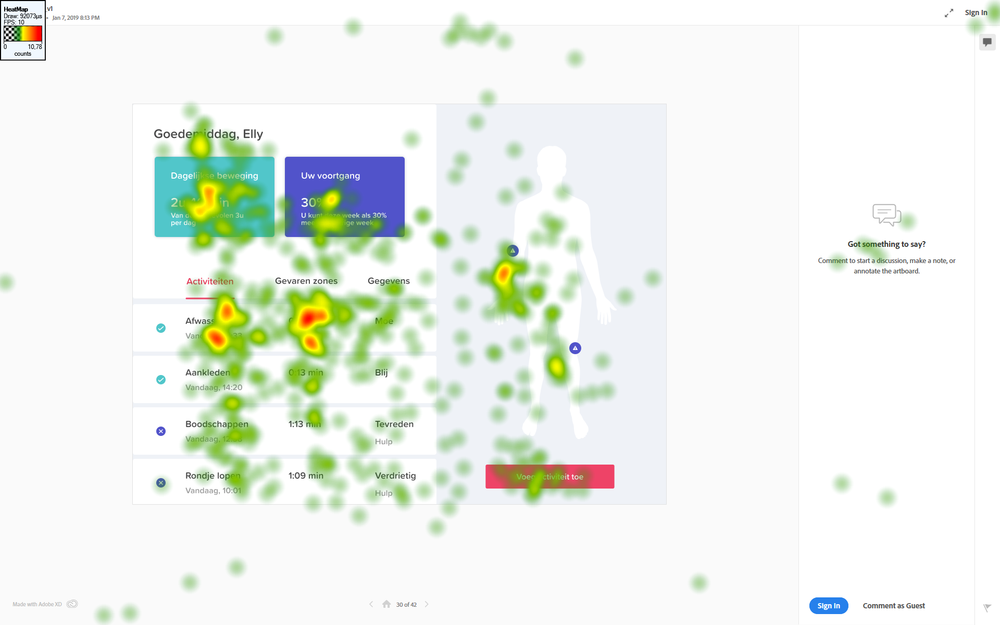
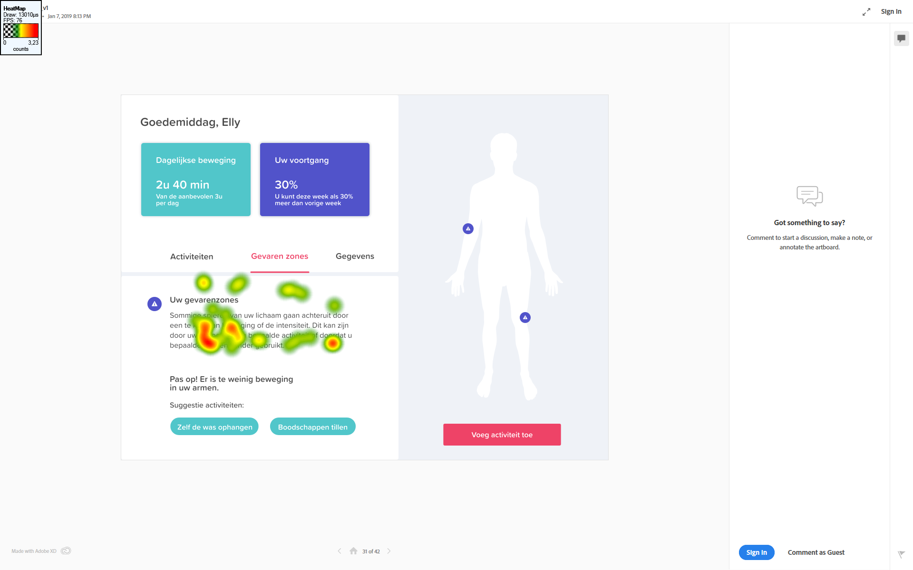
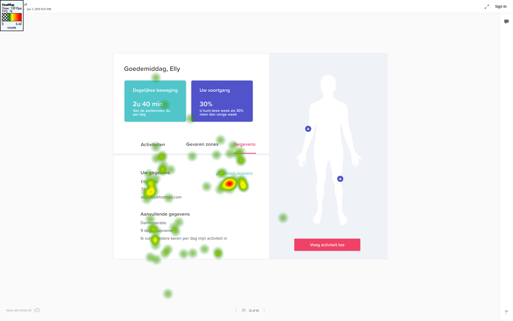
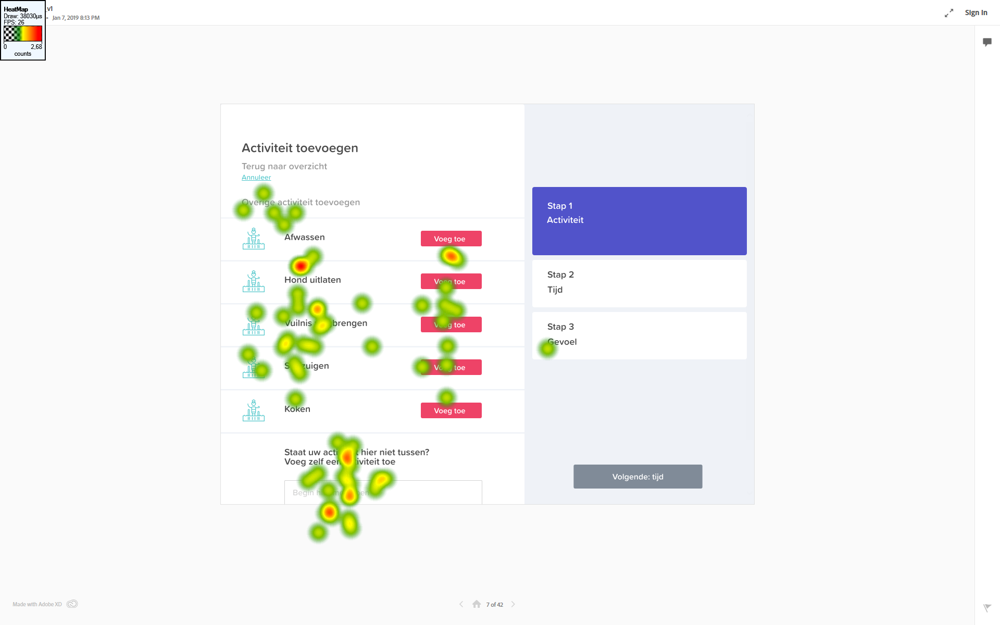
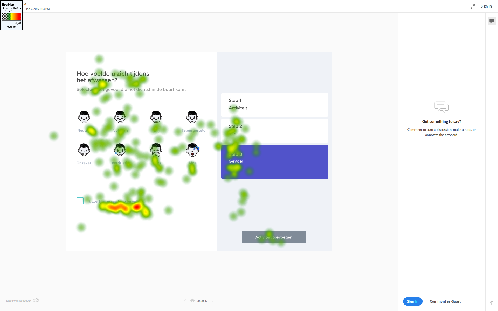

# Usability test

In het usability lab hebben we getest met de versie ****[**Hi-Fi prototype 1.0**](../). We hebben een [**testplan**](testplan.md) gemaakt die de tester moest volgen tijdens het testen van de app. Achteraf hebben we feedback gevraagd en vragen gesteld over de app. 

## Verzamelde data

De gaze plots hebben ons erg geholpen om te kijken of de hierarchie in onze pagina's klopte. Aan de hand van de gaze plots konden we zien of knoppen die we als primair hadden bedacht ook echt als eerst op vielen. Aan de hand van de heatmaps hebben wij kunnen zien welke plekken op de pagina het meest werden bekeken.

## Gaze plot

### Activiteit toevoegen

Dit zijn gaze plots van twee verschillende testers \(links en rechts\). Uit deze test is gebleken dat de knop die "disabled" is ook wordt overgeslagen. Dit hebben wij express gedaan omdat dit geen primaire actie is. Er is te zien dat de testers eerst de tekst lezen boven aan de pagina. Als tweede stap een icoon bekijken, daarna de stappen aan de zijkant bekijken en als laatste nog een keer de iconen doornemen. Hieruit is wel te zien dat sommige iconen overgeslagen worden.

### Overige activiteit toevoegen

Een stap uit het testplan was het toevoegen van een overige activiteit die nog niet in het overzicht stond. Ook hier merkte we dat de knop die disabled is wordt overgeslagen. Dit is dus een goede manier. Verder zien we dat testpersoon links niet het kopje leest en de tekst onder in wel en testpersoon rechts net anders om. Er wordt niet echt naar de iconen gekeken. Deze gaan we daarom ook aanpassen. De knoppen zijn wel duidelijk want die worden door beide testpersonen gezien.

### Gevoel toevoegen

Bij dit scherm moesten de testpersonen een gevoel toevoegen. Wanneer de knop roze is wordt deze wel gezien. Als hij grijs is wordt hij overgeslagen. We waren bang dat de tekst "Ik zou hier graag hulp bij willen" zou worden overgeslagen. Door het doen van deze test zijn we erachter gekomen dat allebei de testpersonen hier juist meerdere keren naar hebben gekeken.

## Heat maps

### Begin scherm

Het begin scherm is de belangrijkste scherm. Uit de heat map is te zien dat er overal op de pagina wordt gekeken. Naar de belangrijkste punten van ons scherm wordt ook het meest naar gekeken. De twee blokken boven in beeld en het overzicht. Ook wordt er gekeken naar de kleine rondjes. De roze knop wordt nog weinig naar gekeken terwijl deze wel erg belangrijk is.

Wanneer de testpersoon het tweede tabje opent zie je dat de tester zich richt op de informatie die gegeven wordt. De blauwe knoppen onderin worden overgeslagen. Deze moeten we op een andere manier gaan vormgeven. Wat ook mist is de connectie die wordt gemaakt met het lichaam rechts van het scherm. De tekst gaat over de gevaren punten die aangegeven worden in het lichaam aan de rechter kant.

De gegevens zijn duidelijk weer gegeven. De testers hebben vooral gekeken naar de knop bewerk gegevens. Hierdoor weten wij dat deze knop duidelijk genoeg is en dus niet aangepast hoeft te worden. Verder heeft de tester de rest van de tekst door gelezen.

### 

### Activiteit toevoegen

In de heat map is te zien dat ook hier weer de grijze knop wordt overgeslagen. Verder is er het meest gekeken op de plekken van de toevoeg knoppen. Deze zijn duidelijk genoeg op de pagina vermeld. Ook is er veel gekeken naar het toevoegen van een eigen activiteit. We waren bang dat deze misschien onvindbaar zou zijn. De kopjes zijn allemaal gelezen alleen de iconen zijn bijna allemaal overgeslagen. Daarom passen we ook hier de iconen aan.

### Gevoel toevoegen

Op deze heat map is duidelijk te zien dat de om hulp vraag knop het meest wordt bekeken. Dit is positief omdat dit een belangrijke actie is op deze pagina. Alle iconen zijn bekeken op de pagina en de tekst is gelezen. Op dit scherm hoeft niet veel veranderd te worden. Wel is hier naar de grijze knop gekeken, maar dit is maar heel kort geweest.





