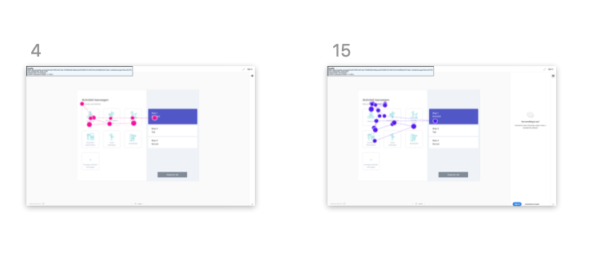
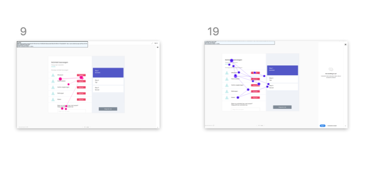
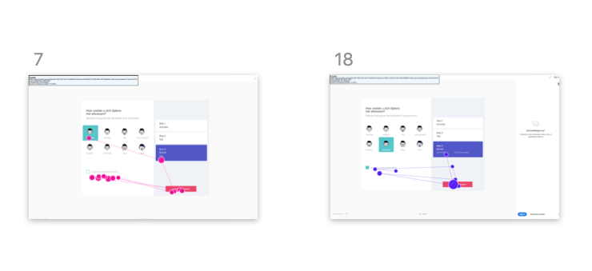
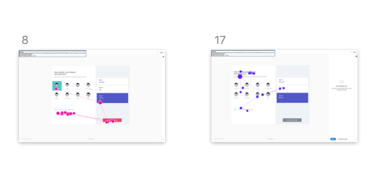

# Usability test

In het usability lab hebben we getest met de versie ****[**Hi-Fi prototype 1.0**](../). We hebben een [**testplan**](testplan.md) gemaakt die de tester moest volgen tijdens het testen van de app. Achteraf hebben we vragen gesteld over de app en feedback gevraagd. 

## Verzamelde data

De gaze plots hebben ons erg geholpen om te kijken of de hierarchie in onze pagina's klopte. Aan de hand van de gaze plots konden we zien of knoppen die we als primair hadden bedacht ook echt als eerst op vielen.

## Gaze plot

### Activiteit toevoegen

Dit zijn gaze plots van twee verschillende testers \(links en rechts\). Uit deze test is gebleken dat de knop die "disabled" is ook wordt overgeslagen. Dit hebben wij express gedaan omdat dit geen primaire actie is. Er is te zien dat de testers eerst de tekst lezen boven aan de pagina. Als tweede stap een icoon bekijken, daarna de stappen aan de zijkant bekijken en als laatste nog een keer de iconen doornemen. Hieruit is wel te zien dat sommige iconen overgeslagen worden.

### Overige activiteit toevoegen

Een stap uit het testplan was het toevoegen van een overige activiteit die nog niet in het overzicht stond.

### Gevoel toevoegen





