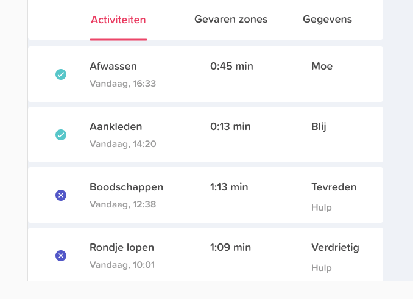

# Testplan

**Inleiding doelgroep**

**Case**

Een 85-jarige vrouw wordt acuut opgenomen op de afdeling Inwendige Geneeskunde met koorts en kortademigheid. De afgelopen 2 weken ging het thuis matig, ze was vermoeid en lag meer in bed. Ze krijgt intraveneuze antibiotica omdat een lobaire pneumonie wordt geconstateerd. De eerste dagen op de afdeling ligt ze veel op bed, voelt zich duizelig en moe. 3 dagen na opname gaat zij voor het eerst weer lopen. Ze voelt zich zwak en lopen gaat moeizaam. Na 5 dagen kan ze naar huis. Ze is nog steeds moe, beweegt weinig, slaapt en eet slecht. Ze voelt zich thuis niet meer zo veilig als voor de  opname en is het vertrouwen in haar eigen lichaam kwijt \(Bianca M. Buurman en Sophia E. de Rooij, 2015\).

De test is bedoeld voor ouderen die door gevolg van een ziekenhuisopname last hebben van functieverlies. Dat betekent dat zij essentiële activiteiten zoals wassen, aankleden en lopen niet meer zelfstandig kunnen uitvoeren. Het herstel hiervan is erg moeilijk. In het ergste geval kunnen de ouderen uiteindelijk vastzitten aan permanente thuiszorg.

**Omschrijving concept**

Een beter herstel door middel van gerichte motivatie en aansporing tot beweging van familie/vrienden op de pijnpunten van de patiënt.

## Anne

* **Taak 1: Open de app**

   **Is het overzicht duidelijk?**

   _Ja, ik zie dat ik ben ingelogd, ik zie de voortgang en de activiteiten die ik heb gedaan. Ik zie welk lichaamsdeel ik moet bewegen._

   **Is het duidelijk waar de informatie voor staat \(gekleurde blokken bovenaan\)?**

   _Voortgang is van beweging of van de activiteiten? de procenten zijn duidelijk alleen het is niet duidelijk hoever in wat ze betekenen. Ze gaat ervanuit dat dit over de activiteiten gaat._

   **Zijn alle kopjes duidelijk en passend?**

   _Ik dacht dat titels bij de rijen eronder hoorde. Pas wanneer je erop klikt is het duidelijk dat het kopjes zijn. Verder zijn de titels duidelijk._

   **Kunt u zonder instructies de app gebruiken?**

   _Ja het is wel voor de hand liggend. Dus niet perse instructies nodig._

* * **Taak 2a: Voeg een activiteit toe aan uw dagelijkse beweging**

   **Is het gelukt om een activiteit toe te voegen?**

  _Ja, het was voor mij niet duidelijk dat je de activiteit invult als je hem hebt gedaan en niet die je gaat doen._ 

   **Ging dit makkelijk?** 

   _Ja, erg simpel._

   **Waren de stappen duidelijk?**

   _Ja de uitleg bij de stappen was duidelijk._

   **Is het duidelijk waar de iconen voor staan?**

   _iconen zijn juist handig en maakt het te begrijpen ._

   **Ging het vragen om hulp \(in de app\) makkelijk?**

  _Ja je kon dit aanvinken, het viel alleen niet erg op omdat het erg klein is. En krijg je dan hulp bij de volgende keer? dus wil je hulp bij de volgende keer._

  \*\*\*\*

* **Taak 2b:Voeg zelf activiteit aan de lijst toe**

   **Is het gelukt om een activiteit toe te voegen?**

   _ja, wel makkelijk te vinden_

   **Ging dit makkelijk?** 

   _ja_

   **Is de knop goed te vinden?**

   _ja_

* * **Taak 3: Pas uw gegevens aan**

   **Was dit makkelijk te vinden?**

   _ja, omdat het een andere kleur is om aan te passen_

  **Ging het aanpassen van uw gegevens makkelijk?** 

   _ja_

## **Algemene vragen:**

**Omschrijf wat volgens u het doel van de app is**

Ouderen stimuleren om te bewegen en activiteiten te doen.

**Zijn er dingen die niet duidelijk zijn?**

De titeltjes in het overzicht. Misschien losse buttons.

**Waar had u moeite mee?**

Nee

**Wat zou u nog veranderen?**

De kopjes en het gedeelte bij de taak kiezen, grotere plaatjes.

**Zou u uw gevoel bij de activiteit willen doorspelen naar uw familie/vrienden zodat ze u zouden kunnen helpen waar u moeite bij heeft?**

De drempel ligt wel lager.

**Zouden uw familie/vrienden te hulp schieten als ze zien dat u ergens moeite mee hebt?**

Ja denk het wel 

**Heeft u nog aanvullende tips?**

Niet echt  
  

## Robin

* **Taak 1: Open de app**

   **Is het overzicht duidelijk?**

  _Ja, wat wordt er bedoelt met gevaren zones? Bovenste blokken zijn duidelijk. Moeite met been en arm? wat zijn de gevaren zones? Ik snap wat het zijn alleen niet wat het doet._

   **Is het duidelijk waar de informatie voor staat \(gekleurde blokken bovenaan\)?**

  _Ja, zijn duidelijk. Kan ik zien wat ik vorige week heb gedaan?_

   **Zijn alle kopjes duidelijk en passend?**

  _Dacht dat de titels bij het rijtje eronder horen. Het lijken kopjes boven de rijen. Pas toen ik klikte kwam ik erachter._

   **Kunt u zonder instructies de app gebruiken?**

  _Genoeg uitleg, iconen zijn duidelijk. Denk om kleuren van de driehoek en het blok._  

* **Taak 2a: Voeg een activiteit toe aan uw dagelijkse beweging**

   **Is het gelukt om een activiteit toe te voegen?**

  _Iconen bij je lijst als je afwassen hebt gekozen bijvoorbeeld. Waar zijn de tijden op gebaseerd? uitleg dat het na het doen van de oefening is want het lijkt alsof het plannen is._

   **Ging dit makkelijk?** 

  _Ja, redelijk, de activiteit zelf wel alleen de emoties was nog niet duidelijk._

   **Waren de stappen duidelijk?**

  _Ja korte stappen._

   **Is het duidelijk waar de iconen voor staan?**

  _Iconen zijn duidelijk._ 

   **Ging het vragen om hulp \(in de app\) makkelijk?**

  _Ja, staat op de juiste plek. Niet duidelijk dat het voor de volgende keer is : "Hulp bij willen voor de volgende keer" omdat het anders op dit moment is._

  _\*\*\*\*_

* **Taak 2b: Voeg zelf activiteit aan de lijst toe**

  **Is het gelukt om een activiteit toe te voegen?**

   _Ja, 'annuleer’ knop duidelijker maken._

   **Ging dit makkelijk?** 

   _Ja_

   **Is de knop goed te vinden?**

   _Ja, misschien iets meer los staand zodat hij meer opvalt._  

* **Taak 3: Pas uw gegevens aan**

   **Was dit makkelijk te vinden?**

   _ja_,

  **Ging het aanpassen van uw gegevens makkelijk?** 

   _ja, wil je dat de dokter het invult en zou je dit zelf willen kunnen aanpassen? is dit van belang? Krijg je mailtjes?_  

## **Algemene vragen:**

**Omschrijf wat volgens u het doel van de app is**

Het doen van klusjes in huis binnen een bepaalde tijd en er hulp bij vragen. Hij geeft aan dat je knie nog niet zo goed is dus daar meer aandacht aan geven \(dit meer in de app naar voren halen : "Hallo je knie is nog niet helemaal hersteld ga nu een stukje lopen"\). Bij activiteit kiezen van een aanbevolen oefening. 

**Zijn er dingen die niet duidelijk zijn?**

De titeltjes in het overzicht. Zorgen dat het lijkt op tabbladen. Niet uitlijnen met de tekst eronder. Of een balkje voor duidelijke scheiding. 

**Waar had u moeite mee?**

Indicatie dat je begint en eindigt of apart neer zetten op de home pagina. "Wat vond je van deze activiteit?"

**Wat zou u nog veranderen?**

Uitleg bij het poppetje, waarom gevaren zones? 30 % beter dat je dat bij de knie kan zetten of je doet nog niet genoeg. koppelen aan je arm.

**Zou u uw gevoel bij de activiteit willen doorspelen naar uw familie/vrienden zodat ze u zouden kunnen helpen waar u moeite bij heeft?**

Zelf vragen doen ze niet, vaak zeggen ze "ik heb geen hulp nodig". De drempel is erg hoog. De app moet wel de drempel lager zetten. Ik wil hulp van : familie of vrienden. 

**Zouden uw familie/vrienden te hulp schieten als ze zien dat u ergens moeite mee hebt?**

Ja denk het wel.  

## Uitkomsten

Een punt wat steeds terug kwam uit de test en tijdens de presentatie was dat de tabs leken op kopjes die horen bij de tekst eronder omdat ze uitlijnen met de tekst eronder. We hebben hier [iteraties](../../high-fi-prototype-2.0/iteratie-hi-fi-prototype-2.0.md) voor gemaakt.

