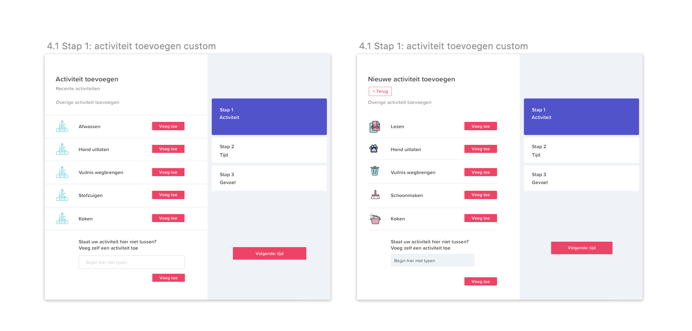

# Aanpassingen

## 0.0 Login

Login schermen zijn toegevoegd. Deze hadden wij nog niet aangepast t.o.v het interactie ontwerp omdat dit niet heel relevant was om te testen. De gebruikers kunnen inloggen met email en wachtwoord. Dit hoeft eenmalig en de gegevens worden daarna onthouden. De reden voor het account is dat de gegevens beschermd kunnen worden met email en wachtwoord en dus niet iedereen erbij kan.

## 0.1 Sign up

Ook is er een aanmeld pagina gemaakt. Deze was eerst ook alleen te zien in het interactie ontwerp. De linkerkant is scrollbaar en de rechterkant staat vast. Hier zijn de radio buttons voor de notificaties geoptimaliseerd voor ouderen. Hier vullen ze dus ook in wanneer en hoevaak ze een melding willen mochten ze hun beweging vergeten in te vullen. 

## 0.2 Wachtwoord vergeten

Het kan natuurlijk gebeuren dat de app op een ander device gedownload word en er opnieuw moet worden ingelogd. Dan kan het gebeuren dat gebruikers hun wachtwoord vergeten. Deze kan worden hersteld met behulp van het email adres van de gebruiker. 

## 1.0 Onboarding

Uit de [**test**](../high-fi-prototype-1.0/test.md) ****bleek dat het fijn was om een kleine onboarding te geven van de app en hoe je de app gebruikt. Dit is een onderdeel dat wij, met meer tijd, graag beter hadden willen uitwerken. Wij hebben hier wel een kleine opzet voor gemaakt. De twee belangrijkste funtionaliteiten worden toegelicht. 1. Activiteit toevoegen en **wanneer** je de activiteit toevoegd. Dit was namelijk vaak nog onduidelijk in testen. Of ze het voordat ze de activiteit doen invullen of erna. 2. Uitleg van de lichaamsgesteldheid en wat ze kunnen doen om dit te verbeteren. 

## 2.0 Home

> Dit is het home scherm voor de gebruikers. Hier kunnen ze in één oogopslag zien wat hun dagelijkse beweging en gevarenzones zijn. Ook kunnen ze hier als primaire actie een activiteit toevoegen. Het is de bedoeling dat ze hun beweging toevoegen als ze deze hebben afgerond zodat ze in het overzicht op de homepagina kunnen zien hoelaat ze het hebben gedaan, wat ze hebben gedaan, hoelang, hoe ze zich voelde en of ze hulp wilden.

Uit de [**usability test**](../high-fi-prototype-1.0/usability-testing/) bleek dat het vaak onduidelijk was wat de tabjes aan de bovenkant waren. Door de witruimte tussen de tabs en de bijbehorende content was het niet duidelijk dat deze twee dingen met elkaar in verband stonden. Ook lijnde de tabjes precies uit met de content eronder. Echter hebben gevaren zones en 1:13 min niets met elkaar te maken. Dit is eigenlijk "toeval" want gevarenzones gaat naar een ander blok. Door te kijken naar design patterns van tabjes hebben wij besloten om er daadwerkelijk een tab van te maken. Hierdoor zie je gelijk dat activiteiten hoort bij wat eronder staat.

## 2.1 Lichaamsgesteldheid

> Bij de gevarenzones kan de gebruiker zien welke delen van zijn/haar lichaam gevaar lopen en dus risico lopen op functieverlies. Onderaan staan suggesties wat hij/zij daar tegen zou kunnnen doen. De gebruiker moet deze activiteiten wel nog zelf gaan doen en word dus niet gedwongen tot een activiteit. De gebruiker komt ook op deze tab als hij/zij op een van de gevaren driehoekjes rechts klikt, dan opent de gevaren zone tab.

Hier zijn alleen het woord en de paarse kleur gewijzigd. Lichaamsgesteldheid is een beter woord dan gevarenzones. Soms was het namelijk niet duidelijk wat het precies inhield. Ook schikt dit de gebruiker misschien af of worden ze onnodig bang gemaakt. Ook is de kleur anders. We hebben namelijk, na aanleiding van feedback van Marjolein, echt gekeken qua kleurgebruik wat bij elkaar hoorde. De groene kleur is voor alles wat met activiteit te maken heeft en paars is voor de lichaamsgesteldheid. Hierdoor voorkomen we verwarring en maken we het de gebruiker duidelijk wat waarbij hoort.

## 3.0 Gegevens

> Op deze pagina kan de gebruiker zijn/haar gegevens aanpassen. Het gaat hier vooral om het aantal keer melding per dag. De gebruiker kan namelijk meldingen ontvangen als zij/hij nog geen activiteiten heeft ingevuld op het aangegeven tijdstip \(meerdere keren per dag of 1 keer per dag\). Ook kunnen hier de gegevens worden gewijzigd.

Na aanleiding van feedback van Marjolein zijn we dus gaan kijken naar wat bij elkaar hoorde. Gegevens hoorde daar eigenlijk dus niet in het rijtje terug. Ook is dit geen primaire feature omdat die gegevens niet dagelijks worden gewijzigd. We hebben gekozen om dit, voor de rust en de consistentie, los te trekken. Het is geen primaire actie en kan dus verder weg worden "gestopt". Ook bleek uit de [**test**](../high-fi-prototype-1.0/test.md) dat het "bewerk gegevens" knopje erg klein was om aan te klikken en over het hoofd werd gezien. We hebben deze nu onderaan gezet en gevuld met een opvallendere paarse kleur i.p.v een underlined link. 

## 3.1 Gegevens bewerken

> Als de gebruiker op "bewerk gegevens" heeft geklikt dan kan hij/zij de gegevens aanpassen in de invul velden. Met de radio buttons kan er gekozen worden voor de hoeveelheid meldingen als de gebruiker vergeet de activiteiten in te vullen.

We hebben de ruimte tussen invulvelden en de radio buttons groter gemaakt. Deze stonden nu heel dicht op de invulvelden en waren erg klein om met een vinger aan te kunnen klikken, en zeker voor ouderen. Ook hebben we een active state toegevoegd als de gebruiker begint met typen. Het invulveld krijgt dan een paarse outline. 

Zodra de gebruiker begint met typen dan verschuift de knop gelijk. Nu is de "sla wijzigingen op" niet meer disabled maar de primaire actie geworden. Annuleren is nu underlined maar wel nog paars. Dit hebben we gedaan om de gebruiker wel nog te laten zien dat annuleren ook nog een optie is, ookal is er iets gewijzigd. Door de "sla wijzigingen op" nu paars te maken hopen we hiermee de aandacht te trekken om niet vergeten op te slaan. Dit is nog een aanname en zouden wij, bij meer tijd, in het usability lab nog willen testen. Als de gebruiker de wijzigen opslaat komt hij/zij weer op het home scherm of het scherm waar hij/zij vandaan kwam.

## 4.0 Activiteit toevoegen

> Er worden 6 recente acitiviteiten getoond voor de gebruiker. Dit gaat op basis van de activiteiten die door jou het meest worden gedaan. In eerste instatie worden en random 6 activiteiten laten zien. Het is ook altijd mogelijk om een overieg activiteit toe te voegen mocht jouw activiteit er niet bij staan.

Uit de test 1 en 2 bleek dat vele testpersonen niet wisten of ze de activiteit moesten invullen **voordat** ze begonnen aan de activiteit of **nadat** ze de activiteit gedaan hadden. Om dit iets duidelijker te maken hebben wij in de onboarding uitgelegd dat je dit invult **nadat je de activiteit hebt gedaan.** Ook hebben wij dit proberen te bereiken door de titel aan te passen. Door de vraag te stellen welke activiteit ze hebben gedaan willen we duiden op de verleden tijd. Ook hebben wij op basis van de [**testen**](../methods/style-test.md) en het [**onderzoek**](../../analyse/onderzoeksvragen/oudere-vriendelijke-ui.md) naar iconografie en kleurgebruik nieuwe iconen toegevoegd die aansluiten bij de activiteit en stijl van de app. 

## 4.1 Activiteit toevoegen

> Hier kan de gebruiker kiezen uit verschillende activiteiten die door de app al gegenereerd zijn. Mocht de app echt gemaakt worden zouden wij deze lijst nog graag uitbreiden met activiteiten. Als hier de activiteit van de gebruiker niet tussen staat kan hij/zij altijd de activiteit zelf nog toevoegen door middel van het invulveld onderaan de pagina.

Hier hebben we ook de nieuwe iconen gebruikt en hebben we voor elke acitiviteit een nieuw icoon gebruikt. Ook hebben we heb invulveld dezelfde stijl gegeven als alle andere invulvelden bij het bewerken van je profiel. We waren ook nog een terug knop vergeten toe te voegen mocht je toch geen eigen activiteit willen toevoegen.

## 5.0 Activiteit geselecteerd

> Als er een activiteit geselecteerd word dan wordt het blok groen om meer nadruk te leggen op de geselecteerde keuze. Ook komt de keuze en het icoon rechts van de pagina in het stappenplan te staan. De knop veranderd ook van de grijze disabled state naar de roze primaire actie state om te laten zien dat de gebruiker nu verder kan. Door de roze kleur laten we de volgende stap even extra opvallen.

Ook hier is de titel veranderd om te suggereren dat het in het verleden is en dus na de activiteit moet worden ingevuld. 

## 5.1 Activiteit toegevoegd

> De nieuwe toegevoegde acitiviteit is gelijk geselecteerd omdat deze net is aangemaakt door de gebruiker. Er komt een blokje bij de recente activiteiten van de gebruiker. Er kunnen maximaal 9 blokken op 1 pagina inclusief de "overige activiteit toevoegen" knop.

Ook hier is de titel veranderd om te suggereren dat het in het verleden is en dus na de activiteit moet worden ingevuld. 

## 6.0 Tijd 

> Hier geeft de gebruiker aan hoelang de activiteit geduurd heeft. In eerste instantie staat er 0 minuten maar zodra de gebruiker de spinner beweegt komt er in het blauw het aantal uur en minuten te staan.

Na aanleiding van de [**test**](../high-fi-prototype-1.0/usability-testing/testplan.md) hebben we de tijd spinner veranderd. We hebben gekeken naar andere design patronen voor tijd en hebben uiteindelijk deze gekozen. Hij is duidelijker en groter voor ouderen. Er kan op geklikt worden. Zit de gebruiker aan de bovenkant dan gaat hij omhoog en bij de onderkant omlaag. Er hoeft niet precies op het icoontje geklikt te worden. Ook kan er een waarde ingevuld worden als de gebruiker op de getallen klikt. 

## 7.0 Gevoel

> De gebruiker vult hier in hoe hij/zij zich voelde bij de uitgekozen activiteit. Er is gekozen voor smileys om uit te kiezen zodat de gebruiker niets hoeft te typen op de iPad en visueel een keuze kan maken tussen emoties. Het is zo simpeler en sneller.

Uit de [**test**](../high-fi-prototype-1.0/usability-testing/testplan.md) bleek dat het niet helemaal duidelijk was wanneer je dan hulp krijgt en of je dit invult als je op dit moment niet meer verder komt. Het is de bedoeling dat je de volgende keer hulp krijgt. Door de tekst te veranderen hebben we dit duielijker gemaakt. Ook hebben we de titel veranderd. Omdat het een prototype was kan de tekst niet telkens veranderen en komt er dus, bij welke activiteit je ook aanklikt, "hoe voelde u zich tijdens het afwassen". Dit is vewarrend en hebben we dus veranderd naar "hoe voelde u zich tijdens deze activiteit". In de ideale situatie waarin het gecodeerd is willen we "hoe voelde u zich tijdens \[naam activiteit\]?"  laten zien zodat ze nog weten om welke activiteit het gaat. 

## 8.0 Gevoel geselecteerd 

> De gebruiker kan een gevoel selecteren door op de smiley of het woord te klikken. Als ere en emotie is geselecteerd kan hij/zij door naar de volgende stap of nog de optie help aanvinken.

Ook hier hebben we de titel veranderd. Omdat het een prototype was kan de tekst niet telkens veranderen en komt er dus, bij welke activiteit je ook aanklikt, "hoe voelde u zich tijdens het afwassen". Dit is vewarrend en hebben we dus veranderd naar "hoe voelde u zich tijdens deze activiteit". In de ideale situatie waarin het gecodeerd is willen we "hoe voelde u zich tijdens \[naam activiteit\]?"  laten zien zodat ze nog weten om welke activiteit het gaat. 

## 9.0 Hulp gevraagd

> Het is mogelijk om de hulp functie aan de vinken. Hierdoor laat je je familie en vrienden via de app weten dat je daar hulp bij zou willen. Zij kunnen dit zien op hun homepagina met acitiviteit en lichaamsgesteldheid van de patiënt. Het is ook mogelijk om je voldaan te voelen bij een activiteit maar toch hulp te willen de volgende keer.

Ook hier hebben we de titel veranderd. Omdat het een prototype was kan de tekst niet telkens veranderen en komt er dus, bij welke activiteit je ook aanklikt, "hoe voelde u zich tijdens het afwassen". Dit is vewarrend en hebben we dus veranderd naar "hoe voelde u zich tijdens deze activiteit". In de ideale situatie waarin het gecodeerd is willen we "hoe voelde u zich tijdens \[naam activiteit\]?"  laten zien zodat ze nog weten om welke activiteit het gaat. 

## 11.0 Home verzorger

> Hier kunnen de familie, vrienden of mantelzorgers de activiteiten van de gebruiker zien. Ook zijn hier de gevarenzones zichtbaar van de gebruiker. Door deze twee gegevens van de gebruiker te delen met de verzorger kan er gerichter hulp en motivatie worden gegeven aan de gebruiker. De verzorger kan precies zien waar de gebruiker moeite mee had en hoe hij/zij zich daarbij voelde.

We hebben de homepagina van de verzorger aangepast. Dit is een onderdeel dat we voor de rest niet verder hebben uitgewerkt omdat hier geen tijd meer voor was in het project. We hadden graag nog een soort progressie/voortgang willen tonen zodat de verzorgers kunnen zien hoe het met de patiënt ging. Dit hebben we niet bij de patiënt zelf gedaan omdat dit alleen maar verwarrend kan zijn voor ouderen en niet goed zichtbaar. 

