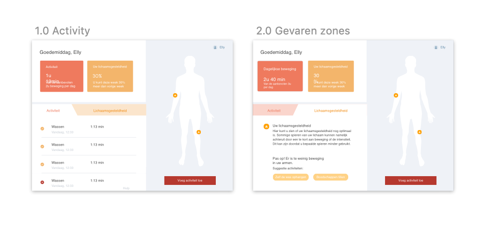
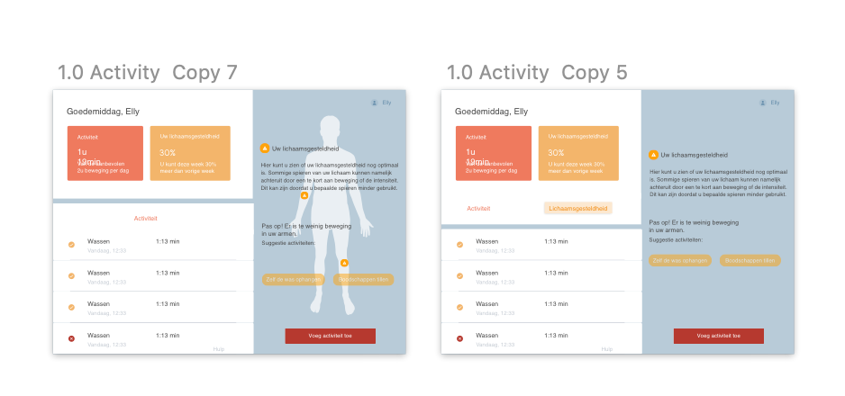
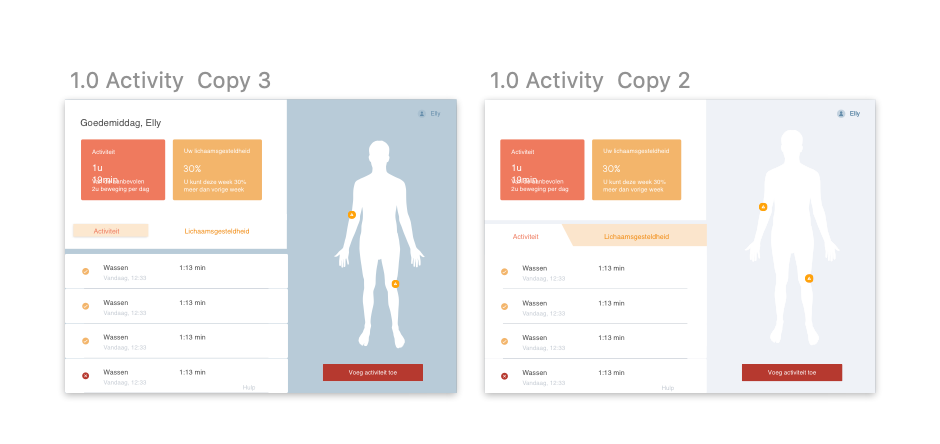

# Iteratie Hi-FI prototype 2.0

> Uit deze test is gebleken dat het overzicht met blauwe kleuren beter zichtbaar is. Door het hoge contrast in kleur is dit beter zichtbaar en duidelijker voor ouderen \(zie [iconen test](../methods/style-test.md)\).

We hebben een iteratie gemaakt op het Hi-Fi prototype 2.0. We hebben onderzoek gedaan die aangaf dat de bruin tinten de angst bij ouderen wegneemt. Na dit te testen vonden de oudere het blauwe concept toch beter eruit springen. Ook zijn dit iteraties op de feedback van het usability [testen](../high-fi-prototype-1.0/usability-testing/testplan.md).

