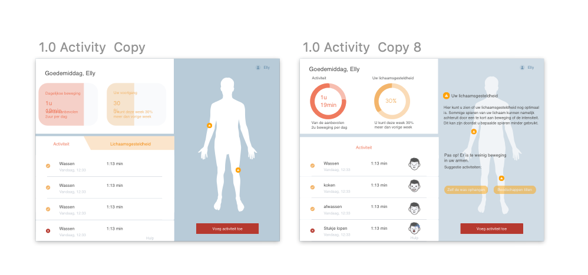
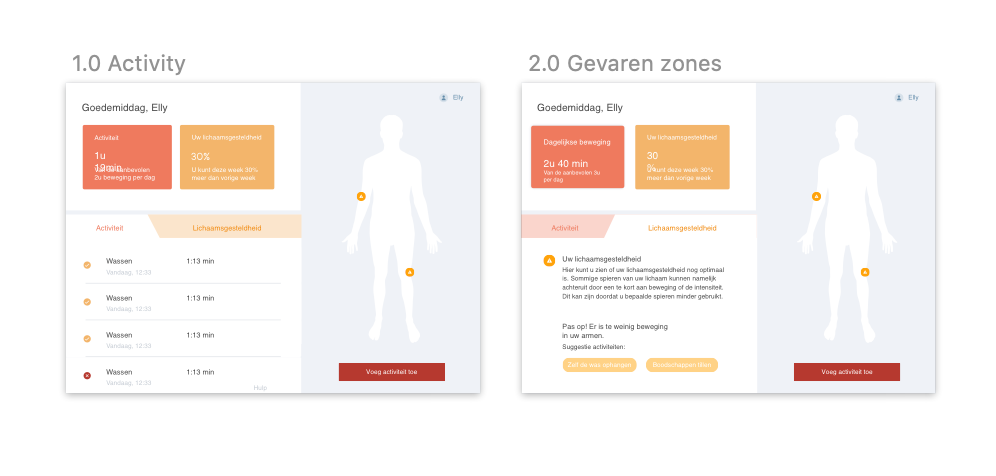
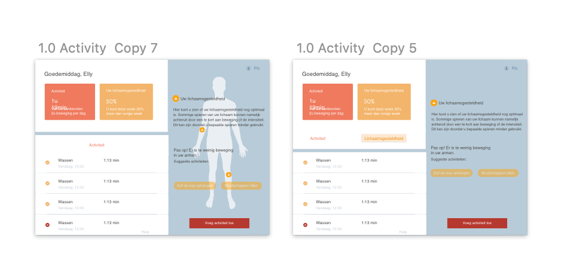
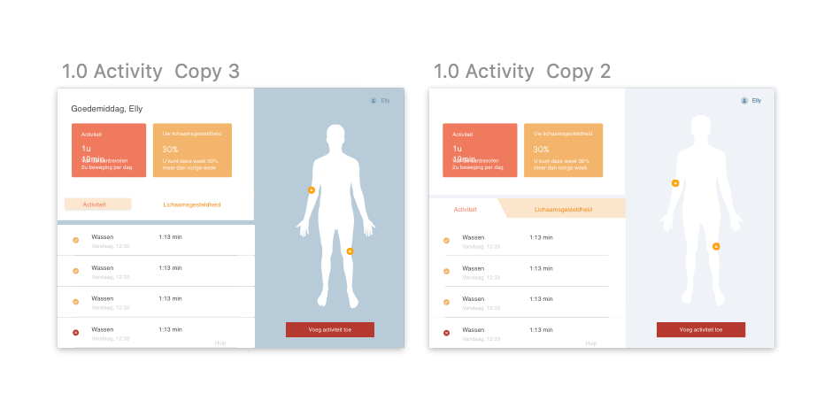

# Test

### Wat vind u duidelijker als u kijkt naar het kleurgebruik van de app?

> De lens en het hoornvlies worden donkerder en geler van kleur en onze pupillen worden kleiner. Ons gezichtsveld beperkt zich en bij staar wordt het licht als het ware ‘verstrooid’. Kleuren komen bij ouderen gedempter over – het verschil tussen de kleuren onderling wordt zogezegd minder. Daarom is het goed om te werken met kleuren die elkaar contrasteren, zoals witte borden op een donker tafelkleed.Warme kleuren bevorderen een gevoel van veiligheid en harmonie en kunnen dus helpen bij gevoelens van eenzaamheid en angst. Door heldere kleuren te gebruiken wordt het verlies van gezichtsscherpte tegengegaan. Dat hoeft niet ten koste te gaan van de ‘warmte’ van kleuren; kleuren zoals ‘perzik’, ‘warm bruin’ en ‘abrikoos’, ‘terracotta’ en roze zijn kleuren die lang goed zichtbaar blijven \(zie [onderzoeksvragen](/project/analyse/onderzoeksvragen/oudere-vriendelijke-ui)\).

We hebben een iteratie gemaakt op het Hi-Fi prototype 2.0. We hebben [**onderzoek**](../../analyse/onderzoeksvragen/oudere-vriendelijke-ui.md#welke-kleuren-zijn-geschikt) gedaan die aangaf dat de bruin tinten de angst bij ouderen wegneemt terwijl ander [**onderzoek**](../../analyse/onderzoeksvragen/oudere-vriendelijke-ui.md#w-3-c-richtlijnen) juist weer aantoonde dat hoge contastkleuren beter waren. Om een goede keuze te maken tussen de twee onderzoeken hebben we testen gedaan. We hebben een verpleegkundige de twee versies meegegeven. Ze ging deze voorhouden bij oudere patiënten. Na dit te testen vonden de oudere het blauwe concept toch beter eruit springen. Ook zijn dit iteraties op de feedback van de usability [**test**](../high-fi-prototype-1.0/usability-testing/testplan.md).

