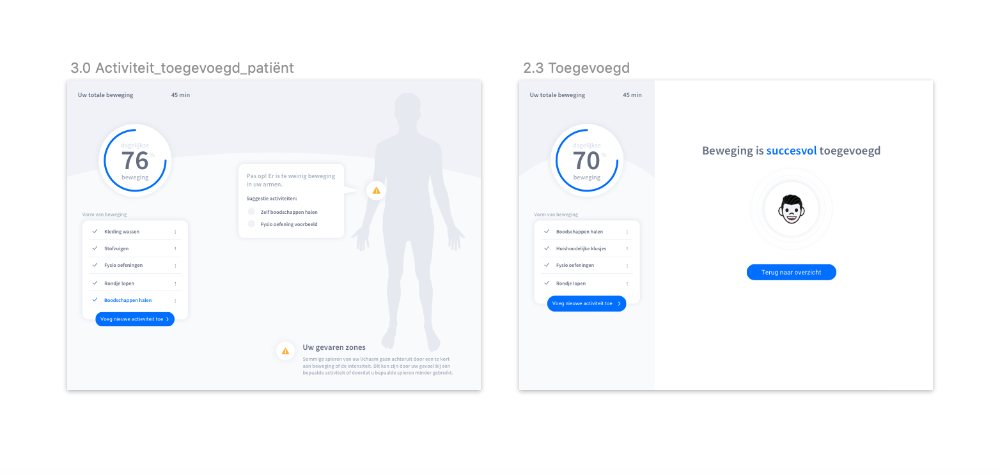
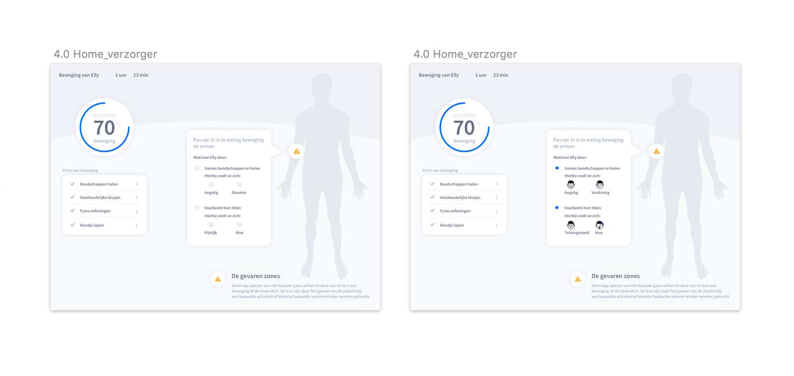

# Ontwerp

In het Lo-Fi prototype 2.0 hebben we aanpassing gedaan n.a.v de [**test**](../high-fi-prototype-1.0/test.md) ****uitkomsten. Links is het Lo-Fi prototype 1.0 en rechts de iteratie hiervan. 

> [https://xd.adobe.com/view/bfb76b8c-2d5c-40cb-506c-fe7bd257a333-c986/](https://xd.adobe.com/view/bfb76b8c-2d5c-40cb-506c-fe7bd257a333-c986/)

## 1.0 Home

> Hier kan de patiënt zien wat voor beweging er vandaag al is gedaan, hoeveel procent dit is van de dagelijkse hoeveelheid en zijn/haar gevaren zones.

De bullet points zijn iets kleiner gemaakt zodat ze niet meer leken op placeholders voor iconen of radio buttons. Buttons en tekst zijn iets groter gemaakt. Activiteit \(spelfout\) is in alle schermen aangepast.

## **2.0 Kies activiteit**

> De gebruiker kan hier schillende dagelijkse activiteiten kiezen. Zijn/haar meest recente activiteiten komen hier direct te staan. Het gaat hierbij om basis activiteiten die functieverlies tegen kunnen gaan. Er kan ook zelf een activiteit worden toegevoegd \(nog niet zichtbaar in de schets nu\).

Het was vrij verwarrend dat er kruisjes stonden in plaats van iconen. Hierdoor was het niet duidelijk wat de functie van het element was en hoe het werkte. Aan de hand van deze feedback heb ik iconen gezocht die in de buurt kwamen van de soort activiteit.

## 3.0 Tijd

> De patiënt geeft hier aan hoe lang de activiteit heeft geduurd zodat de app bij kan houden of de patiënt de dagelijkse hoeveelheid beweging heeft gehad.

De silder van de tijd was ingewikkeld. Je had voorheen twee manieren waarop je de tijd kon invullen. Uiteindelijk hebben we ervoor gekozen om het op dezelfde manier de toen als IOS: een spinner. Bovenin staat de tijd in het blauw in minuten en uren.

## 4.0 Gevoel

> De patiënt geeft hier aan hij/zij zich bij de activiteit voelde. Deze gegevens worden doorgegeven aan de verzorger/familie zodat zij kunnen zien waar de patiënt moeite mee heeft. Zo kunnen ze gericht motiveren om een bepaalde activiteit te doen of ze kunnen het samen doen om de patiënt meer veiligheid/zekerheid te geven.

We hebben in deze versie placeholder iconen vervangen voorbeeld iconen toegevoegd. Ook bleek uit onze proof of concept dat het mogelijk moet zijn om hulp te krijgen bij een positieve emotie. Eerst werd hulp automatisch gevraagd bij een negatieve emotie. Dit moet natuurlijk ook mogelijk zijn bij een postitieve emotie. Ook is de tekst veranderd naar de gelecteeds activiteit boodschappen.

## 5.0 Activiteit toegevoegd

> De activiteit is toegevoegd aan de dagelijkse beweging. De meter gaat van 70% naar 76% en onderaan het lijstje van activiteiten komt in het blauw.

Om te zorgen dat oudere de kleine hint van 70-76 en de blauwe activiteit niet over het hoofd zien hebben we een extra scherm toegevoegd met een bevestiging dat je activiteit is toegevoegd. De gebruiker ziet nu eerst dat de activiteit succesvol is toegevoegd en kan dan terugkeren naar het overzicht.

## 6.0 Home verzorger

> De verzorger**/**familie kunnen hier zien welke onderdelen van het lichaam nog niet genoeg bewegen en waardoor dat komt. Voelde de patiënt zich onzeker? Doet hij/zij te weinig til oefeningen. De verzorger/familie kunnen de patiënt motiveren om meer van deze activiteiten te doen of ze kunnen te hulp schieten om de patiënt meer veiligheid/zekerheid te geven.

Hier hebben we de emoties gekoppeld aan de suggestie activiteiten. Zo kunnen verzorgers ook gelijk zien hoe diegene zich erbij voelde. Voorheen was dit nog niet mogelijk. Hierdoor kan er beter worden gekeken naar het gevoel en kan daarop worden ingespeeld. Ook hier zijn de bullet points kleiner en duidelijker gemaakt.

