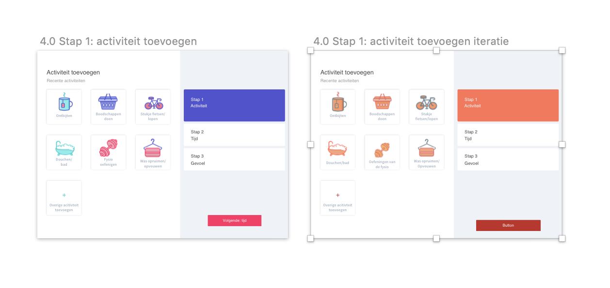

# Iconen test

## Iconen

In ons oude prototype hebben we twee verschillende soorten sets met iconen gebruikt. Voor consistentie hebben we gekozen om 1 iconenset te gebruiken. Om er voor te zorgen dat we de beste set met iconen gebruiken hebben we aan 6 oudere \(60+\) gevraagd wat voor hen het beste werkt en welke iconen het meeste aanspreekt. Aan het eind van het testen was er een duidelijk antwoord: de iconen set met kleuren en die gevuld zijn, zijn het duidelijkste. De iconen set met losse strepen zijn te gedetailleerd om te zien op een scherm voor de ouderen. Dit komt ook door de kleur waardoor de iconen slecht te zien zijn. De gevulde iconen vonden ze prettiger omdat ze sprekender en duidelijker zijn.

## Onderzoek

> De lens en het hoornvlies worden donkerder en geler van kleur en onze pupillen worden kleiner. Ons gezichtsveld beperkt zich en bij staar wordt het licht als het ware ‘verstrooid’. Kleuren komen bij ouderen gedempter over – het verschil tussen de kleuren onderling wordt zogezegd minder. Daarom is het goed om te werken met kleuren die elkaar contrasteren, zoals witte borden op een donker tafelkleed.Warme kleuren bevorderen een gevoel van veiligheid en harmonie en kunnen dus helpen bij gevoelens van eenzaamheid en angst. Door heldere kleuren te gebruiken wordt het verlies van gezichtsscherpte tegengegaan. Dat hoeft niet ten koste te gaan van de ‘warmte’ van kleuren; kleuren zoals ‘perzik’, ‘warm bruin’ en ‘abrikoos’, ‘terracotta’ en roze zijn kleuren die lang goed zichtbaar blijven \(zie [onderzoeksvragen](../../analyse/onderzoeksvragen/oudere-vriendelijke-ui.md)\).

### Iteratie n.a.v onderzoek

Nadat we hebben gekozen voor de gevulde iconen hebben we nogmaals een iteratie gedaan. Dit hebben we voor gelegd bij tien verschillende ouderen. Uit deze test is gebleken dat het overzicht met blauwe kleuren beter zichtbaar is. Door het hoge contrast in kleur is dit beter zichtbaar en duidelijker voor ouderen. 

We kwamen hierdoor tot de conclusie, dat in deze gedetailleerde iconen het belangrijk is dat de buitenkant \(outline\) een groot contrast heeft met de binnenkant. Hierom hebben we gekozen voor een zwarte outline. 

