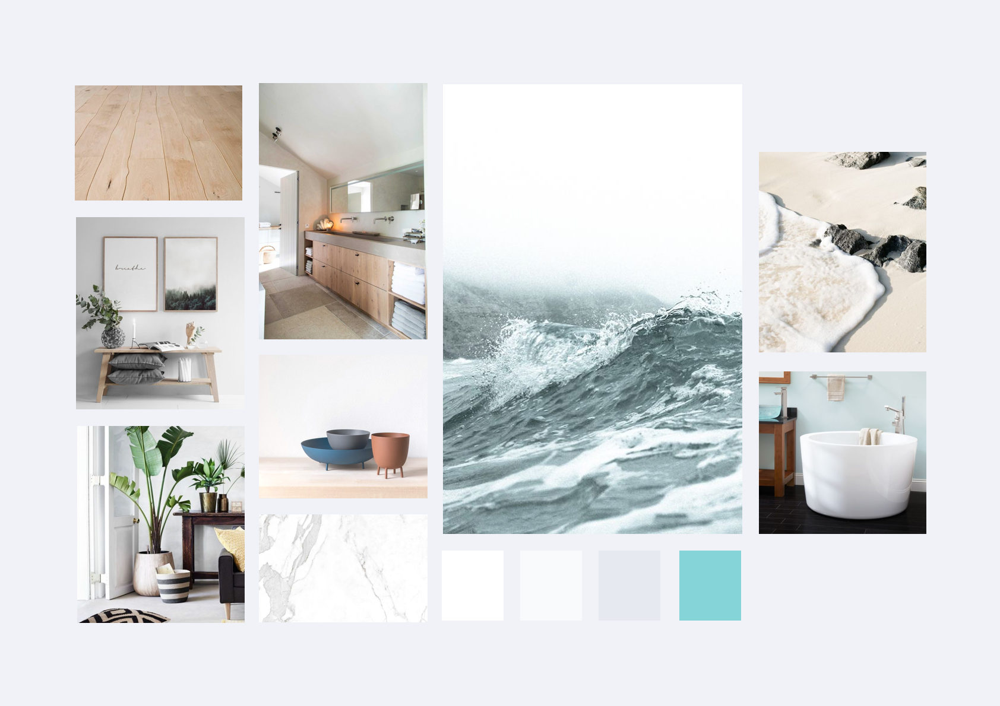

# Moodboard

Voordat we zijn begonnen met het omzetten van het interactie ontwerp naar het visual design hebben we een moodboard gemaakt van de look & feel. Dit is nog gebasseerd op het oude interactie ontwerp en kan dus afwijken van de styleguide. Hierbij is nog geen onderzoek gedaan naar kleurgebruik voor ouderen.

### Moodboard

De uitstraling van onze app moet rustgevend zijn. Zoals in de [**inspriation wall**](../idee-ontwikkeling/methods/inspiratieboard.md) al in meerdere voorbeelden werd aangegeven. Na onderzoek te hebben gedaan naar kleurgebruik en designs voor mensen met verminderd zicht bleek ook dat het belagrijk is om wit met een hogere contrastkleur af te wisselen. Wij willen de rust van dit moodboard terug laten komen in onze app zodat mensen met verminderd zicht niet door te veel verschillende kleuren en elementen worden getriggerd. 

