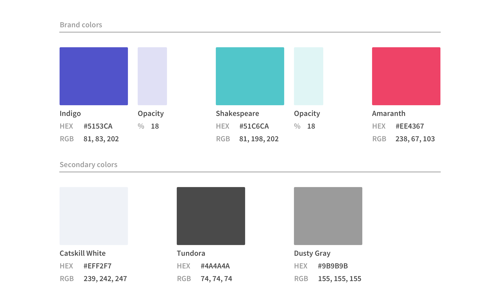
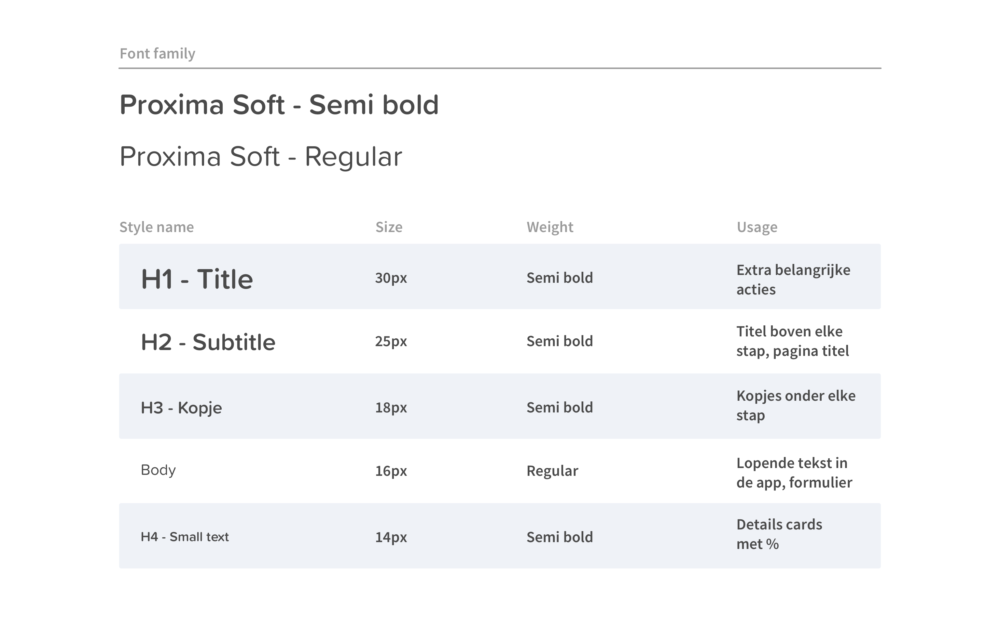
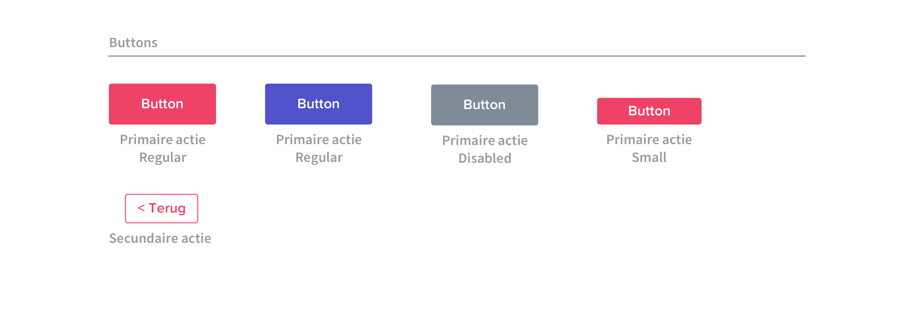

# Styleguide

Aan de hand van het laatste design in het Hi-Fi prototype 1.0 en Hi-Fi prototype 2.0 hebben wij een styleguide gemaakt met de kleuren, typografie en buttons. Per onderdeel kunt u hieronder nog een uitgebreidere onderbouwing lezen. Meer informatie over de [**iconografie**](style-test.md) binnen de app kunt u apart lezen omdat hier een uitgebreid proces achter zit. 

## Kleurgebruik

Er is gekozen voor 3 primairen kleuren die ver genoeg van elkaar afwijken. Dit is bewust gedaan om dit zo goed mogelijk te optimaliseren voor ouderen. Wij hebben uitgebreid onderzoek gedaan naar [**kleurgebruik**](../analyse/onderzoeksvragen/oudere-vriendelijke-ui.md) voor onze doelgroep.

## Typografie

Voor de typografie van de app is er gekozen voor een vriendelijk en zacht lettertype. Door de afgeronde hoekjes komt het lettertype wat zachter over. Ook is er bewust gekozen om grote lettergrootte en donkere body tekst en titels te gebruiken zodat dit goed zichtbaar is voor ouderen. Ook hier hebben wij uitgebreid [**onderzoek**](../analyse/onderzoeksvragen/oudere-vriendelijke-ui.md) naar gedaan.

## Buttons

Voor de buttons is er gekozen voor grote buttons van 46px hoog zodat het tab target groot genoeg is voor ouderen om erop te klikken. Ook is er bewust voor gekozen om primaire acties in het proces roze te maken. Deze kleur springt er echt uit en uit onze [**usability test** ](../5.-validatie/usability-testing.md)is gebleken dat er dan ook vaak naar deze knop gekeken word. Ook zorgt dit voor een stukje herkenning omdat de knop om een actie uit te voeren in het proces, steeds dezelfde kleur is. 

