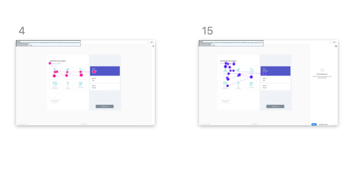
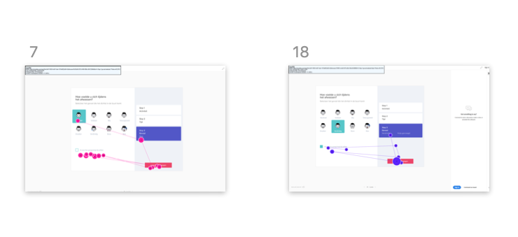

# Usability testing

In het usability lab hebben we getest met de versie ****[**Hi-Fi prototype 1.0**](../high-fi-prototype-1.0/). We hebben een [**testplan**](testplan.md) gemaakt die de tester moest volgen tijdens het testen van de app. Achteraf hebben we vragen gesteld over de app en feedback gevraagd. 

## Verzamelde data

De gaze plots hebben ons erg geholpen om te kijken of de hierarchie in onze pagina's klopte. Aan de hand van de gaze plots konden we zien of knoppen die we als primair hadden bedacht ook echt als eerst op vielen.

## Gaze plot

### Activiteit toevoegen

### Overige activiteit toevoegen

### Gevoel toevoegen





