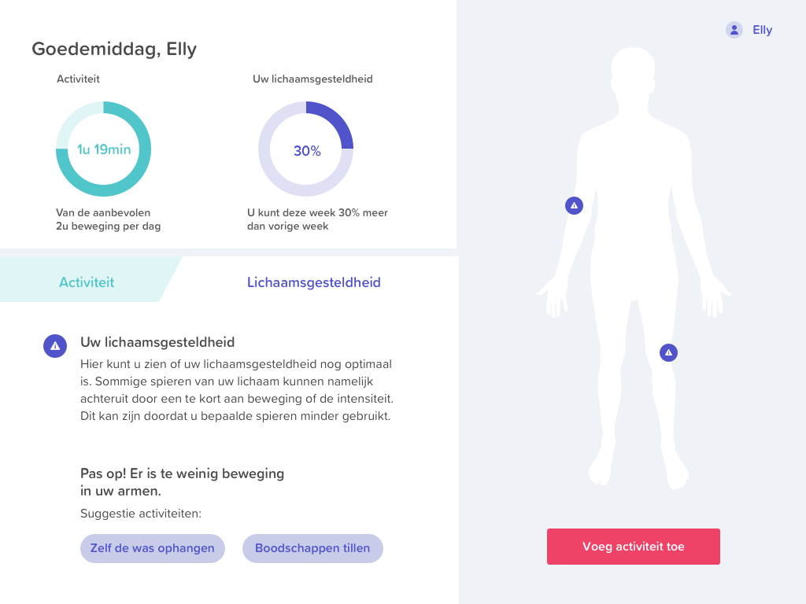

# Hi-Fi prototype 3.0

Ons finale design. Er zijn prototype technisch nog een aantal dingen veranderd. Ook is er nog een crikel diagram toegevoeg waar de gebruiker zijn/haar progressie kan volgen. 

> [https://xd.adobe.com/view/510b6994-35f5-4171-5872-9396a2036c31-273a/?hints=off](https://xd.adobe.com/view/510b6994-35f5-4171-5872-9396a2036c31-273a/?hints=off)

