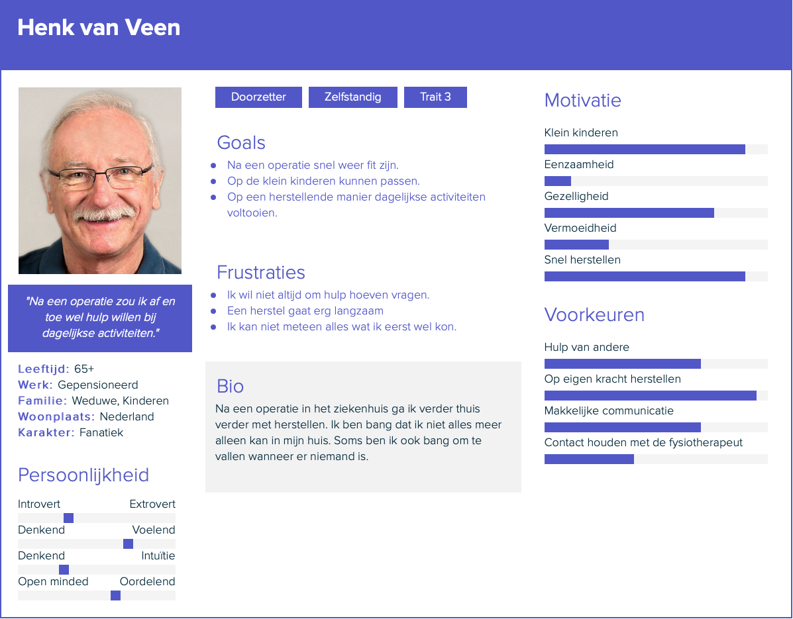
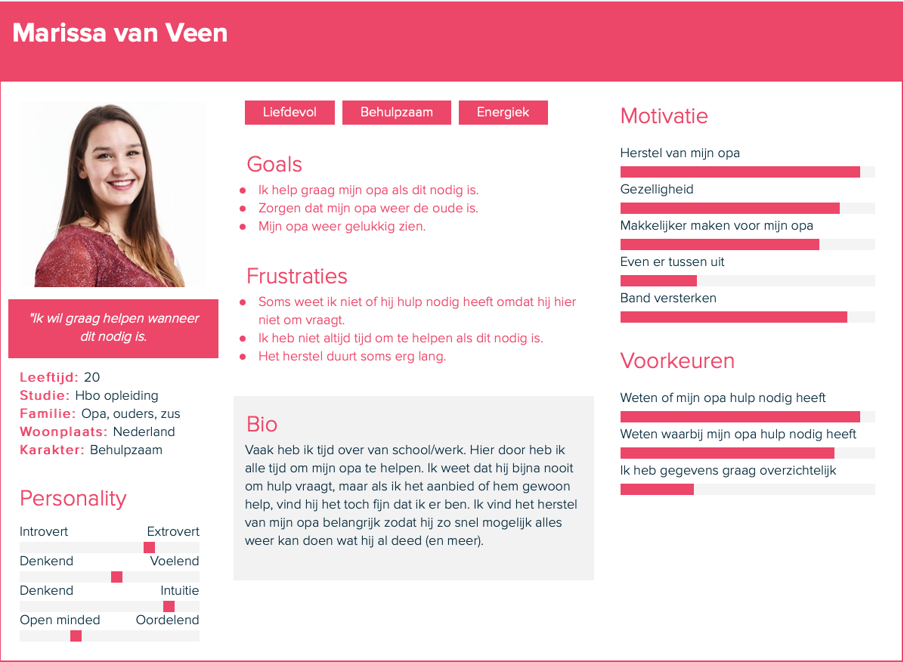

# Persona

> De doelgroep zijn ouderen van 65 jaar en ouder die risico lopen op functieverlies na een operatie. De ouderen herstellen thuis. Deze ouderen vormen de grootste risico groep omdat als zij lijden aan functieverlies, ze daar moeilijk/niet van herstellen en dus uiteindelijk vastzitten aan permanente thuiszorg.

Na het doen van [onderzoek](../onderzoeksvragen/ontstaan-functieverlies.md) zijn wij erachter gekomen dat er een grote groep ouderen aan functie verlies lijdt. Ouderen kunnen de stijd tegen functieverlies niet alleen aan, daarom is het belangrijk dat ouderen, verzorgers en familie de krachten bundelen \(zie [onderzoeksvragen](../onderzoeksvragen/motiverende-rol.md)\). Om een goed overzicht te krijgen van deze doelgroep en een verzorgende hebben wij twee persona's gemaakt. 

## De patiënt \(en opa\)

## Klein dochter

