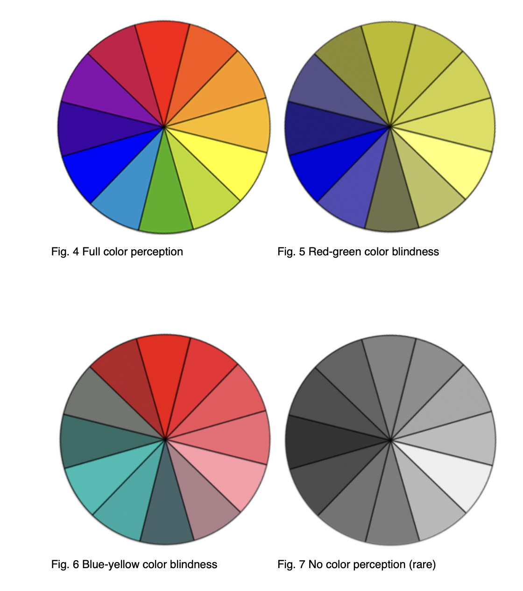
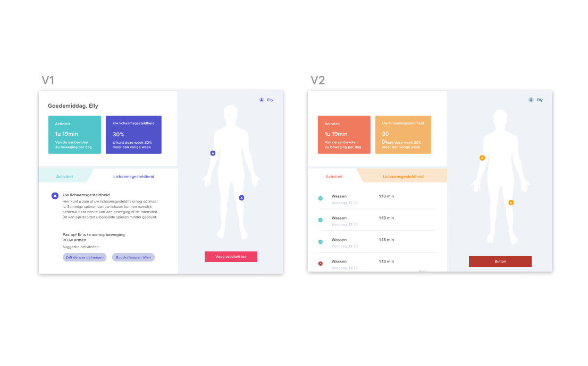

# Waar moet je rekening mee houden als je ontwerpt voor ouderen?

## Welke kleuren zijn geschikt?

> De lens en het hoornvlies worden donkerder en geler van kleur en onze pupillen worden kleiner. Ons gezichtsveld beperkt zich en bij staar wordt het licht als het ware ‘verstrooid’. Kleuren komen bij ouderen gedempter over – het verschil tussen de kleuren onderling wordt zogezegd minder. Daarom is het goed om te werken met kleuren die elkaar contrasteren, zoals witte borden op een donker tafelkleed. Door heldere kleuren te gebruiken wordt het verlies van gezichtsscherpte tegengegaan. \(Zorg voor morgen, 2013\).

### W3C richtlijnen

Via een artikel van [**W3C**](https://www.w3.org/TR/low-vision-needs/#brightness-and-color) hebben wij rekening kunnen houden met contrast tussen kleuren. In onderstaande afbeelding ziet u wat voor varianten aan kleurenblindheid er zijn. Wij hebben, onder andere, na aanleiding van deze gegevens gekozen voor de blauwgroen-achtige en de roze kleur in ons design. Ook hebben wij daar paars aan toegevoegd als derde kleur. Het leek ons niet verstanding om een van de gele kleuren te kiezen aangezien we in ons design veel witte achtergronden gebruiken om het contrast met de donkere tekst te behouden. 

### Test met ouderen

> Some people cannot see certain colors well or at all, usually because of deficiencies in the cone receptors of their eyes which are responsible for color perception. This is commonly called “color blindness”, even though most people who are color blind can see most colors. It is rare that a person cannot see any color at all. Globally, approximately 1 in 12 men \(8%\) and 1 in 200 women have color vision deficiencies. \[_Draft Note:_Reference to be added; some listed in [References](https://www.w3.org/WAI/GL/low-vision-a11y-tf/wiki/References#Color_Vision).\] Color vision deficiencies are not classified as “low vision” or disabilities in many contexts. \(W3C, 2018\)

> Vaak hebben ouderen een voorkeur voor zachtere \(pastel\)kleuren. Deze zijn echter vaak niet helder genoeg voor oudere ogen waardoor het focussen moeilijker gaat. Door heldere kleuren te gebruiken wordt het verlies van gezichtsscherpte tegen gegaan. Dat hoeft niet ten koste te gaan van de ‘warmte’ van kleuren; kleuren zoals ‘perzik’, ‘warm bruin’ en ‘abrikoos’, ‘terra cotta’ en roze zijn kleuren die lang goed zichtbaar blijven. \(Zorg voor later, 2013\)

Om dit bovenstaande onderzoek te bevestigen hebben wij dit ook nog getest onder de ouderen. Een verpleger in het ziekenhuis heeft twee verschillende kleurenpalleten voor haar patiënten gehouden. 1 met wat warmere kleuren en 1 met onze huidige kleuren. Volgens [**zorg voor later**](https://zorgenvoormorgen.org/2013/02/12/de-beste-kleuren-voor-ouderen/) kunnen warme kleuren een gevoel van veiligheid en harmonie bevorderen en kunnen dus helpen bij gevoelens van eenzaamheid en angst. Dit is echter een artikel over interieur en niet over digitale vormgeving. W3C zegt namelijk dat het beter is om contrasterende kleuren te gebruiken en goed onderscheid te maken. Omdat wij in een tweestrijd zaten tussen verschillende bronnen hebben wij het ook gevraagd aan de doelgroep. Vrijwel alle, door de verpleger, ondervraagde ouderen gaven de voorkeur aan ons huidige kleurenpallet met de fellere kleuren. Het zwaarder wegende artikel van W3C en de bevestiging vanuit de doelgroep gaf ons genoeg informatie om te kiezen voor het huidige kleurenpallet. 

## Welke typografie is het best leesbaar?

### Titels

> For some people, bold text is easier to read. For some people, it is difficult to read blocks of text that is all underlined or italicized. \(W3C, 2016\)

Wij hebben gekozen om de titels en buttons dikgedrukt te maken. Hierdoor krijgen ze visueel nog meer onderscheid van de broodtekst en springen ze er net iets meer uit. Ook hebben wij geen schuingedrukte woorden gebruikt omdat dit de leesbaarheid met 18% verminderd volgens fonts.com.

### Tekst

> Text in all capital letters is more difficult to read for most people, with and without disabilities. \(W3C, 2016\)
>
> Avoid long blocks of text by breaking copy into chunks wherever possible. Consider using subheads, bulleted lists and boxes to organize content. \(Fonts.com\)

In ons ontwerp hebben wij geen gebruik gemaakt van captial letters. Dit leest niet prettig en komt niet vriendelijk over. Als wij nadruk op een bepaald element wilden leggen hebben wij dit gedaan door een grotere font size te gebruiken. Hierdoor word hetzelfde effect bereikt maar dan zonder capital letters. Ook hebben we gezorgd dat er maar korte stukjes tekst staan  van rond de 9 woorden op 1 regel. 

### Font size

> Choose your text size generously, with extra leading to increase readability. A minimum of 12 point text on 14 points of leading is a good rule of thumb, although exact sizes may vary depending on the typeface that you choose. \(Fonts.com\)

Omdat wij zo zeker mogelijk wilde zijn van een goede font-size hebben wij gekozen voor een font-size van 16 pixels. Veel groter hebben wij het bewust niet gedaan omdat dit juist weer lastig leesbaar kan worden voor mensen met een blinde vlek. Die hebben dan meer moeite met lezen omdat de letters groter zijn en dus over de vlekken heen vallen. 

