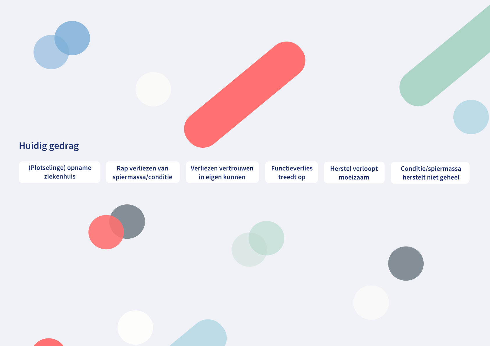
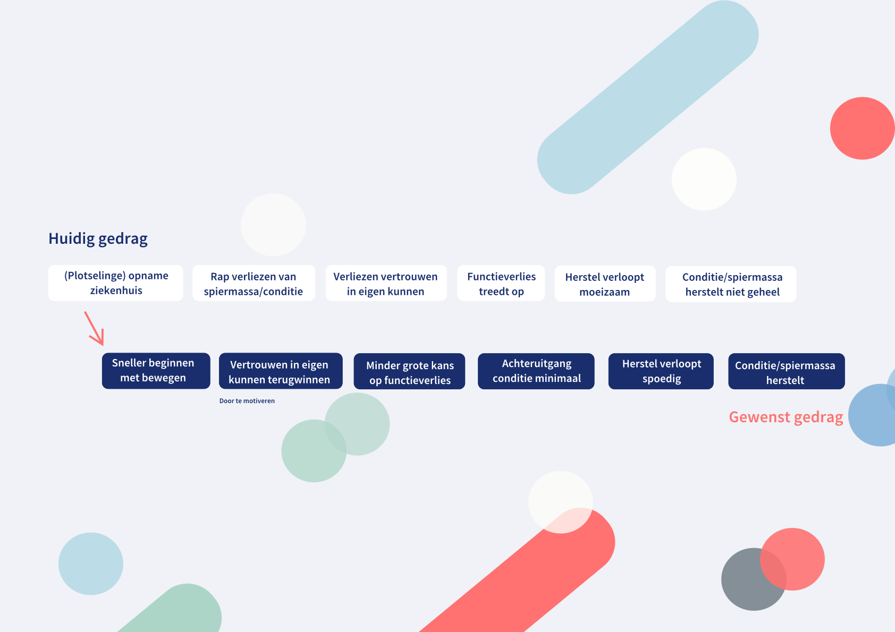
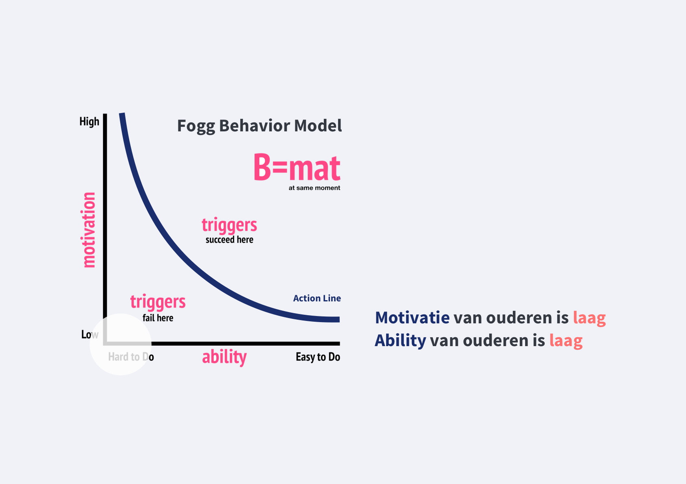

# 1. Map

## Huidig gedrag

### **Mensen \(met name ouderen\) die risico lopen op functieverlies**

Een deel van de 65-plussers heeft na acute ziekenhuisopname te maken met nieuwe beperkingen in het dagelijks functioneren, gedefinieerd als ‘functieverlies’. Gemiddeld lopen patiënten in het ziekenhuis maar 4-7 minuten per dag. Bedrust is echter desastreus voor ouderen. Gezonde ouderen die tien dagen op bed blijven en goede voeding krijgen, verliezen 10-15% van hun spiermassa. Vroegtijdig mobiliseren, ook al zijn mensen nog heel ziek, levert daarom belangrijke gezondheidswinst op. 

Het ziektegedrag dat wordt gezien tijdens een acute inflammatoire respons lijkt bij ouderen in afgezwakte vorm aanwezig te zijn in de eerste maand na ontslag; ouderen slapen nog slecht, zijn moe, hebben weinig eetlust, hebben geheugenproblemen en ervaren apathie  \(Bianca M. Buurman en Sophia E. de Rooij, 2015\).

Een 85-jarige vrouw wordt acuut opgenomen op de afdeling Inwendige Geneeskunde met koorts en kortademigheid. De afgelopen 2 weken ging het thuis matig, ze was vermoeid en lag meer in bed. Ze krijgt intraveneuze antibiotica omdat een lobaire pneumonie wordt geconstateerd. De eerste dagen op de afdeling ligt ze veel op bed, voelt zich duizelig en moe. 3 dagen na opname gaat zij voor het eerst weer lopen. Ze voelt zich zwak en lopen gaat moeizaam. Na 5 dagen kan ze naar huis. Ze is nog steeds moe, beweegt weinig, slaapt en eet slecht. Ze voelt zich thuis niet meer zo veilig als voor de opname en is het vertrouwen in haar eigen lichaam kwijt \(Bianca M. Buurman en Sophia E. de Rooij, 2015\).

## Gewenst gedrag

### **Mensen \(met name ouderen\) die risico lopen op functieverlies**

**Functioneel trainen en meer thuis trainen.**                                                                                                                                               Functioneel trainen is erop gericht mensen bepaalde betekenisvolle activiteiten in het dagelijks leven weer te laten uitvoeren. In plaats van alleen spierversterkende oefeningen te doen, leert de therapeut de patiënt om de handeling beter en veiliger uit te voeren. Het achterliggende principe bij functioneel trainen is dat de patiënt de handeling weer veel vaker doet en er daarmee ook weer vaardig in wordt, zodat hij of zij het vertrouwen in zichzelf herwint. Mogelijk is thuis revalideren even goed en kosteneffectief als revalideren in een verpleeghuis.

### **Beter voorbereiden en voorlichten van ouderen en mantelzorgers**

Omdat veel ouderen zich niet goed voorbereid voelen op de periode na ontslag uit het ziekenhuis en zich overvallen voelen door functieverlies, is het belangrijk om ouderen en mantelzorgers beter voor te bereiden en voor te lichten. We weten dat het geven van schriftelijk materiaal belangrijk is, zodat ouderen het kunnen nalezen. Maar op welke manier voorlichting bij kan dragen aan preventie van functieverlies behoeft verder onderzoek. Daarin is het samenwerken met ouderen cruciaal.

### **Psychische impact van ziekenhuisopname op herstel en motivatie**

Ouderen lijken het vertrouwen in hun eigen lichaam te zijn kwijtgeraakt na ziekenhuisopname \(‘lage self-efficacy’\). Het ontbreken van dit vertrouwen kan het herstelproces negatief beïnvloeden. Cognitief-gedragsmatige interventies die het vertrouwen in het eigen kunnen versterken, gecombineerd met bewegen, kunnen daarom mogelijk bijdragen aan herstel van het functioneren.

Het gedrag wat moet gaan veranderen is gedrag wat voor een langere periode moet aanhouden. Dit hangt per patiënt af van de herstelsnelheid en de conditie.                        \(Buurman, B. M., & De Rooij, S. E, 2015\)

## Fogg behavior model

### Motivatie

Ouderen die net na een ziekenhuisopname werden geïnterviewd over hun functioneren op dat moment, waren volkomen verrast over de negatieve gevolgen van de ziekenhuisopname op hun conditie en functioneren. Bijna alle ouderen hadden de verwachting dat ze in een betere conditie het ziekenhuis zouden verlaten \(Buurman, B. M., & De Rooij, S. E, 2015\). 

Hieruit blijkt dus dat hun eigen motivatie laag is. **De ouderen gaan er dus van uit dat ze zelf niets hoeven te doen om hun conditie op peil te houden maar dat het ziekenhuis dat voor hun regelt.** 

Het tegendeel is echter waar. Dat het ziekenhuis niets doet komt volgens Eimers, D omdat de aandacht vooral uitgaat naar de longontsteking of de gebroken arm waarvoor iemand in het ziekenhuis terechtkwam. De verpleging is druk en moet ook nog op zoveel andere dingen letten. Het is ook lastig om iemand die bang is of zich beroerd voelt, weer op de been te helpen. Veel verpleegkundigen denken: het kost me teveel tijd om met meneer te gaan lopen. 

**Ten tweede is de ziekenhuisomgeving zelf niet ingericht om bewegen te stimuleren.**                   Ziekenhuizen zetten interventies tegen functieverlies namelijk nog lang niet altijd in. Volgens Buurman komt dat doordat gewone verpleegafdelingen van ziekenhuizen er niet op ingericht zijn om patiënten bijvoorbeeld in beweging te krijgen. Op een geriatrische afdeling gebeurt dit wel, daarin werken namelijk artsen, verpleegkundigen en fysiotherapeuten samen ten behoeve van de patiënt \(Skipr, 2015\). Bij veel ouderen ontbreekt de motivatie om actie te ondernemen omdat de trigger ontbreekt. \(Eimers, 2010\)

Ten derde zijn ouderen opgegroeid in de tijd dat er nog drie weken bedrust werd voorgeschreven na een operatie”, zegt verpleegwetenschapper drs. Jita Hoogerduijn. Ze werkte vijftien jaar als verpleegkundige en is nu als onderzoekster verbonden aan het Instituut voor Verpleegkundige Studies van de Hogeschool Utrecht. Ze doet onderzoek naar de gevolgen van bedrust. Jita Hoogerduijn: “Veel ouderen trekken in het ziekenhuis direct hun pyjama aan: ik ben ziek, dus ik moet in bed liggen, denken ze. Hun motivatie is dus laag omdat ze gewend zijn dat bewegen niet hoeft als je ziek bent en je drie weken bedrust kan nemen. Ze zien in dat opzicht de ernst er nog niet van in omdat ze nooit hebben meegekregen hoe gevaarlijk bedrust is.

Harriët Wittink, die jarenlang als fysiotherapeut in verschillende ziekenhuizen werkte, maakte vaak het tegendeel mee. “Als ik langskwam om iemand die herstelde van een heupoperatie snel weer uit bed te helpen, reageerde de familie verontwaardigd: ‘Laat die man toch met rust. Hij heeft pijn en hij is moe.’ Moe? Dat word je vooral van op bed liggen. En pijn: daar is wat aan te doen. Vraag om pijnstillers.” 

Voor familieleden is het niet altijd een prettig idee dat hun breekbare of verwarde moeder door het ziekenhuis scharrelt. Stel dat ze valt en verkeerd terechtkomt? Harriët Wittink: “Dat is een risico, maar vaak is de schade door niet bewegen groter.” Vraag een kamer vlakbij de verpleegpost, zodat de verpleegkundigen de zieke in de gaten kunnen houden. “Waarom zit de familie altijd rond het bed van de zieke?” vraagt verpleegwetenschapper drs. Jita Hoogerduijn zich af. “Ga liever een ommetje maken tijdens het bezoekuur.” **Hieruit blijkt dus wel dat de motivatie van ouderen laag blijft omdat familie en vrienden dit ook niet aanmoedigen.** In tegendeel, vrienden en familie moedigen juist aan om niet te bewegen en in bed te blijven. Indirect zorgen zij dus ook dat functieverlies ontstaat. Ouderen worden door familie en vrienden gedemotiveerd \(Eimers, 2010\).

**Conclusie**                                                                                                                                                                                                                                                                                                         De motivatie van ouderen die risico lopen op functieverlies is dus **laag**.  

### Ability

**Fysieke inspanning**                                                                                                                                                                                                     Om te werken aan spiermassa en conditie moet je veel fysieke inspanning verrichten. Hierdoor wordt de ability verlaagd, hoe meer je je fysiek moet inspannen, hoe kleiner de kans dat mensen het gaan doen \(B.J Fogg\).

**Routine**                                                                                                                                                                                                                 De ability om te bewegen is laag, het is moeilijk omdat het geen routine is. Routinegedrag kost weinig moeite. Het aanleren van nieuwe routines kost daarentegen veel moeite. Het zit niet in het systeem van een oudere die wordt opgenomen in het ziekenhuis omdat, zoals eerder benoemd, dit niet in hun routine zit. Als je ziek bent lig je op bed, denken ze. Het moet een regelmaat worden om meer te bewegen en dat is lastig aan te leren. 

**Tijd**                                                                                                                                                                                                                       Revalideren kost tijd. Mensen kunnen niet na 5 minuten al resultaat zien dus dit maakt de ability om het te doen lastiger. Mensen moeten dus bewuster worden van de gevolgen op langere duur omdat dit negatieve \(niet bewegen\) of positieve \(oefeningen, bewegen\) niet gelijk zichtbaar zullen zijn. Het is dus belangrijk dat ze de meerwaarde van hun tijd ervan in gaan zien.

### **Attitude tov gedrag**

**Waarom zou iemand het gewenste gedrag vertonen?**                                                                                                                Ouderen zouden het gedrag willen vertonen omdat eenmaal opgelopen functieverlies bijna niet meer te herstellen is \(Jansen, 2017\). Dat betekent dat zij essentiële activiteiten zoals wassen, aankleden en lopen niet meer zelfstandig kunnen uitvoeren. Dit is een drijfveer om dus wél te gaan bewegen omdat mensen natuurlijk willen voorkomen dat ze gaan leiden aan functieverlies en permanente zorg nodig hebben. 

Ook word de smartphone steeds populairder bij Nederlanders van vijftig jaar en ouder. Volgens onderzoek van Telecompaper had aan het einde van het eerste kwartaal 84 procent van de Nederlanders in de leeftijdscategorie 50-64 jaar een smartphone. Dat was een jaar eerder nog 67 procent. Bij 65-plussers groeide het smartphonebezit van 54 naar 63 procent, zegt Metro \(2016\).

**Wat houdt hem/haar tegen?**                                                                                                                                                            Wat de ouderen tegenhoudt is dat ze zich niet veilig voelen of bang zijn om te vallen. Ouderen voelen zich thuis niet meer zo veilig als voor de opname en is het vertrouwen in haar eigen lichaam kwijt daarom kiezen zij voor de veilige weg door niet \(veel\) te bewegen of de taken uit handen te geven aan familie of vrienden.

Ten tweede spelen hun ervaringen van vroeger een rol. Ouderen zijn opgegroeid in de tijd dat er nog drie weken bedrust werd voorgeschreven na een operatie, zegt verpleegwetenschapper drs. Jita Hoogerduijn.    

## Voorbeelden

### Help

Het ‘Hospital elder life’-programma \(HELP\)                                                                                                                                                                  ****Het doel van het HELP-programma is het voorkómen van een delier bij patiënten van 70 jaar en ouder tijdens de ziekenhuisopname. HELP is in de VS ingevoerd in verscheidene ziekenhuizen en is effectief gebleken om delier en ook functieverlies te voorkomen \(Inouye, Bogardus, Baker, Leo- Summers, & Cooney, 2000; SteelFisher, Martin, Dowal, & Inouye, 2011\). Het belangrijkste onderdeel van HELP is de inzet van vrijwilligers op de afdeling. Deze vrijwilligers worden geschoold en krijgen tijdens hun inzet op de afdeling begeleiding. De vrijwilligers helpen met oriëntatie, doen activiteiten, wandelen of oefenen met de ouderen en stimuleren het eten en drinken.

Dit kan zorgen voor gedragsverandering omdat de vrijwilligers helpen. Ze kunnen de ouderen motiveren om het gedrag te vertonen. Ook dragen zij bij aan het gevoel van veiligheid. Iets wat ouderen nog vaak weerhoudt om te bewegen. Ze zijn bang om te vallen. Door begeleiding van iemand anders gaat de motivatie omhoog omdat ze minder bang zijn. Samen met de motivatie gaat dan ook de ability omhoog. Het is makkelijker om samen met iemand te bewegen omdat je geholpen kan worden. Ook wordt het nu dus makkelijker omdat je geholpen wordt. Het kost dus minder fysieke inspanning en misschien ook wel minder tijd.

### **Wii-fit**    

Een nieuwe ontwikkeling is het inzetten van games **om ouderen te laten bewegen tijdens ziekenhuisopname.** In Australië is een kleine proeftrial gedaan met de Wii-Fit; deze studie liet verbeteringen zien in het dagelijks functioneren \(Laver, Ratcliffe, George, Burgess, & Crotty, 2011\).

Dit kan zorgen voor een gedragsverandering omdat de motivatie hier hoger is. Het is in de vorm van een game en de drempel is wat lager. Het voelt door het spel misschien minder alsof je aan het bewegen bent en de motivatie is hoger door het wedstrijdelement. Sommige mensen hebben toch het strijdlustige nog in hen. Ook wordt de ability verhoogd omdat het makkelijker wordt om te bewegen. Het voelt namelijk minder als “echt sporten”. Hierdoor kunnen ouderen het op hun gemak doen en als ze pijn ervaren tijdelijk stoppen. Zo voelen ze niet de druk van anderen die bijvoorbeeld mee kijken maar kunnen ze dit bijvoorbeeld alleen doen \(Van Seben, Reichhardt, & Smorenburg, 2016\).

## Verwerkte feedback

* [x] Userflow ontbreekt, begin deze vanaf het moment van opname &gt; gebruik bijvoorbeeld de case van de oudere vrouw 
* [x] Attitude tov gedrag staat verwarrend naast ability
* [x] Design challenge toevoegen
* [x] Misschien iets meer gebruik van visuals. Het komt nu soms vrij kaal over.
* [x] It might be interesting to mention specific details about your user group and their relationship with digital \(smartphones etc\) 
* [x] How will this affect your solution? 
* [x] Will they need to change their digital behaviour as well as their physical behaviour? 

