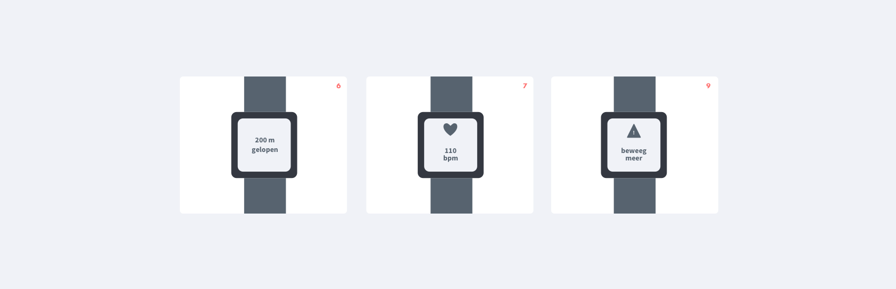

# 2. Sketch

## Ideeën generatie

**Ik heb 25 ideeën gegereerd en die hiernaast snel uitgeschetst met een korte beschrijving per idee.**

**Methodes**                                                                                                                                                                                                     Ik heb de **mash-up** methode gebruikt om ideeën te combineren. Dit heb ik bijvoorbeeld ook in mijn uiteindelijke idee gedaan. In dit voorbeeld is de mash-up te zien tussen 16 en 17. Dit is een mash-up tussen patiënt en verzorger/familie.

Ik heb de **scamper** methode gebruikt om nieuwe mogelijkheden te bedenken voor de smartwatch. Dit is nu niet iets wat veel ouderen hebben. Ik wil het een nieuw startpunt geven door het te gaan gebruiken voor 65+ \(wat nu een kleine doelgroep is van de smartwatch\) voor herstelmogelijkheden.

Ik heb **the worst possible idea** gebruikt om te kijken wat ik allemaal niet wil in mijn oplossing. Ik kon namelijk wel veel dingen bedenken die niet zouden werken maar vond het lastig om te kijken wat wel zou kunnen. Ook heb ik dankzij the worst possible idea kunnen kijken naar alle ideeën die al een beetje bestaan omdat dit dan ook een worst idea zou zijn omdat het er al is.

## Schetsen

**Na aanleiding van de 30 ideeën heb ik de ideeën geclusterd een sommige ideeën verder in detail digitaal uitgewerkt.**




6. Een smartwatch die de data van de beweging van de patiënt doorstuurt naar de familie/mantelzorger.

7. Een smartwatch die de uren waarin de patiënt het moeilijk heeft gehad, doorgeeft aan de familie/mantelzorger. Dit kan zijn bij weinig beweging of bij verhoogde hartslag door stress. 

8. Een smartwatch die een seintje geeft aan de patiënt als hij/zij overdag te weinig aan het bewegen is. 

9. Een smartwatch die een sein geeft aan de verzorgers als de patiënt overdag te weinig aan het bewegen is. 

10. Een app waarbij de patiënt activiteiten moeten loggen. Bij geen activiteit geeft de app een seintje aan de familie/mantelzorger. 




23. Familielid/vrienden die samen oefeningen met de patiënt doen om extra motivatie te krijgen en ook meer vertrouwen omdat je samen bent. 

24. Familielid/vrienden als coach om de patiënt door de oefeningen heen te coachen en extra motivatie in te spreken. 

25. Een videogesprek die familie/vrienden \(1 per keer\) laat meekijken om aan te moedigen als de patiënt oefeningen doet. Ook is dit voor extra vertrouwen omdat er iemand op de patiënt let. 




2. App die verzorgers informatie geeft over de pijnlijke plekken van de patiënt en waar zij de moeite mee ervaren. 

16. Bewustwording voor de patiënt met de gevolgen van functieverlies van langdurig niet bewegen. 

18. Informatieve app over functieverlies voor alle betrokkenen en voor de patiënt zelf.

19. Informatieve app over het motiveren van de patiënt als familie/verzorger. 




3. App die het bewegen stimuleert door middel van het doen van oefeningen voor de patiënt. 

5. App die oefeningen aanbied die functieverlies tegengaat met als beloning een motiverende tekst/video om ze aan te sporen door te gaan. 

12. Motivatie om meer te gaan bewegen door middel van audiofragmenten die bewegen aansporen. 

13. App waarin ouderen aan kunnen geven waarin ze graag hulp zouden willen hebben. Per onderdeel \(lopen, tillen, etc\) kunnen ze aan geven of dit hen wel of niet goed afgaat. 

14. De verzorger geeft de pijnpunten door aan de fysiotherapeut zodat op basis van die pijnputen de oefeningen voor herstel aangepast kunnen worden. 

15. App die hersteloefeningen aanbiedt met een tijdslimiet zodat de gebruiker gemotiveerd is om dit zo snel mogelijk te doen. Dit versnelt het herstelproces. 

20. Reeks opbouwende oefeningen die steeds moeilijker worden en zorgen voor een optimaal herstel voor de patiënt. 

22. App met verschillende reeksen oefeningen die de gebruiker moet uitvoeren. Als de gebruiker elke stap heeft uitgevoerd krijgt hij/zij een motiverende boodschap.   




1. Aanmoedigende berichten.

4. Motiverende tekst van familie/vrienden  wanneer de patiënt aangeeft dat hij/zij het moeilijk heeft of moeite heeft met veel te bewegen. 

26. Motiverende app die de patiënt foto’s en filmpjes toont die de familie/vrienden van te voren hebben gemaakt. 

11. App die aangeeft waar de patiënt moeite mee heeft om gericht te motiveren/aan te sporen op bepaalde handelingen d.m.v hulp van de fysio.

21. App met een “road” naar verbetering. Elke keer als een set met oefeningen voor de dag is afgemaakt krijgt de gebruiker een motiverend bericht van familie/vrienden.



## Verwerkte feedback

* [x] Interessant om motivatie en herstel mogelijkheid te koppelen voor optimaal resultaat. 
* [x] Misschien kan de motivatie nog meer verhoogd worden door dit te koppelen aan commitment. 
* [x] Ideeën zijn nog niet gekoppeld aan de verschillende methodes. Welke methode heb je gebruikt voor welk idee.

