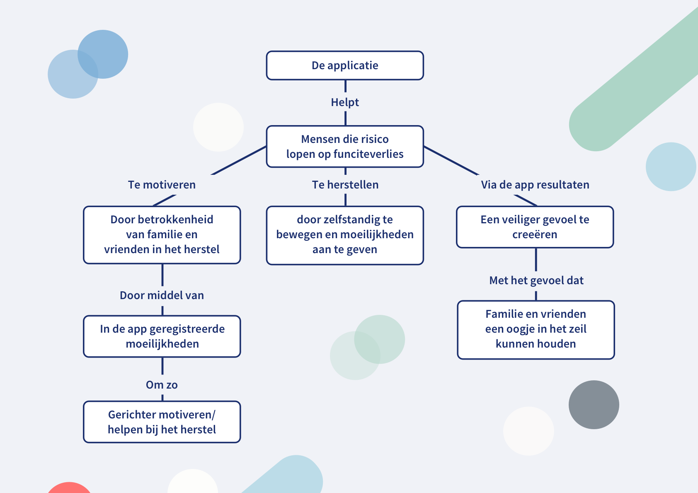
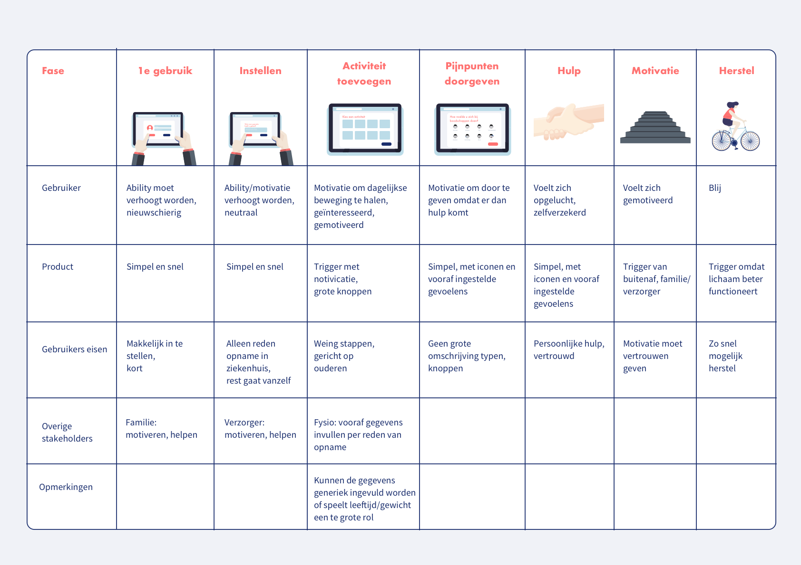

# 3. Decide

## Harris profile

## Concept

### Conceptkeuze

**Ik kies voor een combinatie van ideeën. Ik kies hiervoor omdat de patiënt zelf moet werken aan het herstel maar dit niet alleen kan.**

**Ik kies voor:**                                                                                                                                                                                           11. App die verzorgers informatie geeft over de pijnlijke plekken van de patiënt en waar zij de moeite mee ervaren om zo gericht te motiveren/aan te sporen op bepaalde handelingen. 

16. Bewustwording voor de patiënt met de gevolgen van functieverlies van langdurig niet bewegen. 

13. App waarin ouderen aan kunnen geven waarin ze graag hulp zouden willen hebben. Per onderdeel \(lopen, tillen, etc\) kunnen ze aan geven of dit hen wel of niet goed afgaat.

Het gaat er hierbij dus om dat er samen gewerkt wordt. Veel ouderen geven aan zich niet veilig te voelen of bang te zijn dat ze vallen/iets niet lukt. Door middel van deze toepassing kunnen ze per \(simpele\) dagelijkse bewegingen/activiteiten aangeven waar ze moeite mee hebben/hoe ze zich voelen. Hierdoor kunnen de familie/vrienden gerichter helpen of motiveren om deze activiteit nogmaals \(samen\) te proberen.

### Waarde propositie

**Wat kan iemand doen na het gebruik/aanschaffen van jouw product wat degene daarvoor nog niet kon?** Op weg naar een beter herstel door middel van gerichte motivatie en aansporing tot beweging van familie/vrienden op de pijnpunten van de patiënt. 

**Hoe voelt iemand zich na het gebruik/aanschaffen van jouw product wat degene daarvoor nog niet kon voelen?** Veiliger, mensen weten waar ze pijn mee hebben en kunnen hierbij helpen. Beter omdat ze gericht gelopen kunnen worden met oefeningen/motivatie. 

### Product stance

**Beschrijf de persoonlijkheid van jouw concept: welke karaktereigenschappen heeft hij \(of is het een zij?\)?** Vriendelijk, behulpzaam, \(zij\) 

**Probeer minimaal 5 unieke eigenschappen op te schrijven:** Mijn concept wil behulpzaam, vriendelijk, motiverend, inspirerend en veilig zijn.

**Vertaal deze eigenschappen naar 3 – 4 emotionele eisen:**                                                                                                             Mijn product zal altijd rekening houden met de fysieke gesteldheid van de patiënt.                       Mijn product zal altijd proberen meer te halen uit de patiënt voor een sneller herstel.                    Mijn product zal altijd motiverende feedback geven en geen negatieve feedback. 

## Concept map

**Doel: in kaart brengen en communiceren van complexe producten. Mijn concept map gaat uit van 2 gebruikers. De rol van de patiënt en de rol van verzorger/familie. Hieronder zal ik deze twee gebruikers verder toelichten.**

### **Rol patiënt**

De patiënt is de gene die alle data gegenereerd in de app. Het doel van de app voor de patiënt is het voorkomen van functieverlies. De app helpt hierbij door de patiënt zelfstandig te laten bewegen en aan te geven waar de moeilijkheden zitten. Mocht er te weinig beweging zijn in bepaalde delen van het lichaam, dan laat de app zien waar de gevarenzones zitten die risico lopen op functieverlies.

### **Rol verzorger/familie**

De verzorger/familie houdt een oogje in het zeil om zo bij te dragen aan een veiliger gevoel voor de ouderen. Doordat ze kunnen zien waar de patiënt last van heeft en wat er moeilijk gaat kunnen zij helpen met deze activiteiten. Dit kan door ze aan te moedigen/motiveren om deze activiteit wel te doen of door te helpen met bepaalde handelingen waar de patiënt onzeker over is. 

## Storyboard

**Doel: in kaart brengen hoe het product werkt op basis van de user, waarde propositie en product persoonlijkheid**

