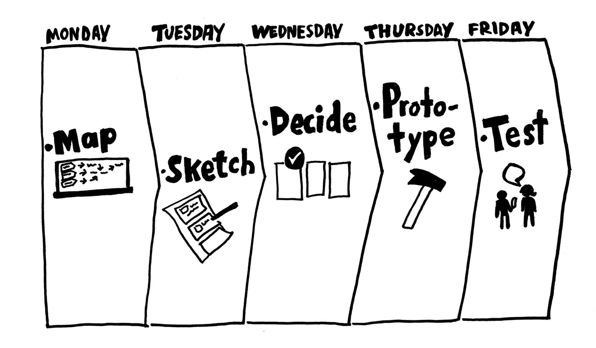

# Design sprint

> A **design sprint** is a time-constrained, five-phase process that uses [**design thinking**](https://en.wikipedia.org/wiki/Design_thinking) with the aim of reducing the risk when bringing a new product, service or a feature to the market.\(Wikipedia, 2018\)

Om ideeën te ontwikkelen en een uiteindelijk concept te bedenken hebben wij met het vak desiging with purpose een [**design sprint** ](./)van 2 weken gehouden. Hier hebben wij 4 fases doorlopen: [**map**](map.md), [**sketch**](sketch.md), [**decide**](decide.md), [**prototype**](prototype.md) ****en [**test**](5.-test.md). In de onderstaande link kunt u de volledige design sprint doorlezen.











