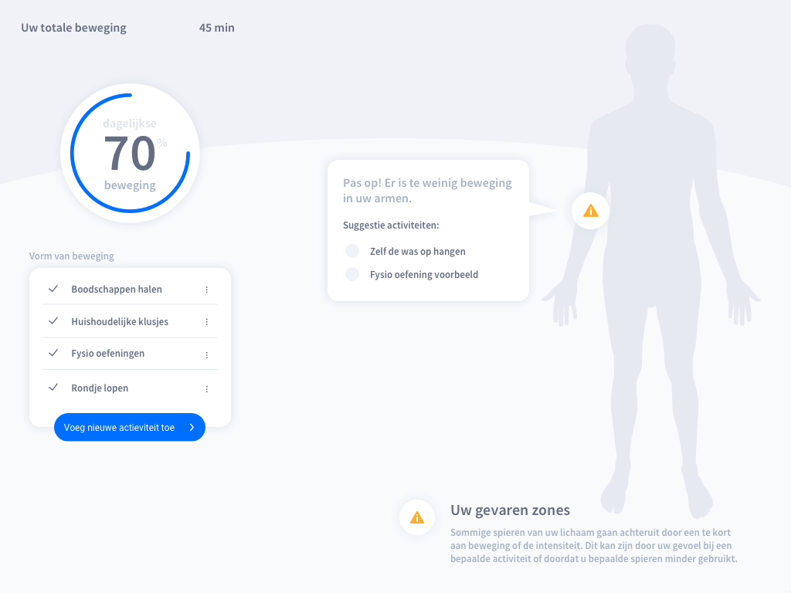
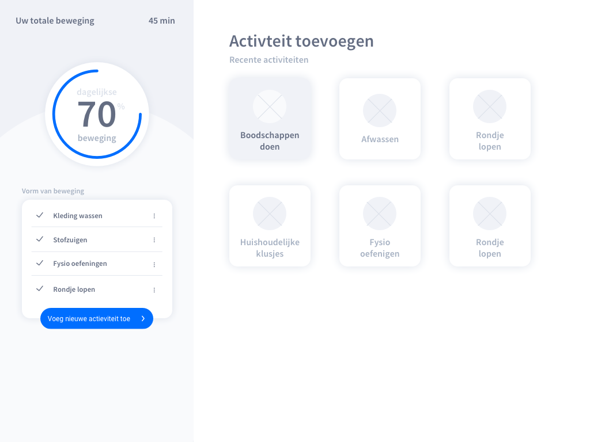
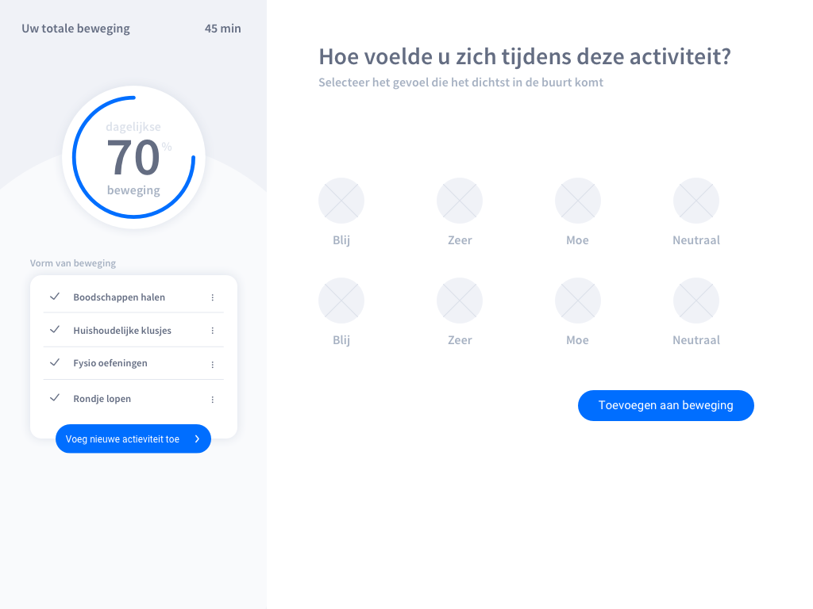

# 4. Lo-Fi prototype 1.0

Na aanleiding van mijn [**conceptkeuze**](decide.md#concept) ****heb ik de eerste Lo-Fi schetsen gemaakt om mee te gaan testen tijdens de eerste peerfeedback ronde in de groep. 

## **1.0  Home**    

De homepagina. Hier kan de patiënt zien wat voor beweging er vandaag al is gedaan, hoeveel procent dit is van de dagelijkse hoeveelheid en zijn/haar gevaren zones.

## **2.0 Kies activiteit**

Kies een activiteit. De gebruiker kan hier schillende dagelijkse activiteiten kiezen. Zijn/haar meest recente activiteiten komen hier direct te staan. Het gaat hierbij om basis activiteiten die functieverlies tegen kunnen gaan. ****Er kan ook zelf een activiteit worden toegevoegd \(nog niet zichtbaar in de schets nu\).

## **3.0 Tijd**    

De patiënt geeft hier aan hoe lang de activiteit heeft geduurd zodat de app bij kan houden of de patiënt de dagelijkse hoeveelheid beweging heeft gehad. 

## **4.0  Gevoel**

De patiënt geeft hier aan hij/zij zich bij de activiteit voelde. Deze gegevens worden doorgegeven aan de verzorger/familie zodat zij kunnen zien waar de patiënt moeite mee heeft. Zo kunnen ze gericht motiveren om een bepaalde activiteit te doen of ze kunnen het samen doen om de patiënt meer veiligheid/zekerheid te geven.

## 5.0 Acitiviteit toegevoegd

De activiteit is toegevoegd aan de dagelijkse beweging. De meter gaat van 70% naar 76% en onderaan het lijstje van activiteiten komt in het blauw.

## **6.0 Home verzorger**

De verzorger**/**familie kunnen hier zien welke onderdelen van het lichaam nog niet genoeg bewegen en waardoor dat komt. Voelde de patiënt zich onzeker? Doet hij/zij te weinig til oefeningen. De verzorger/familie kunnen de patiënt motiveren om meer van deze activiteiten te doen of ze kunnen te hulp schieten om de patiënt meer veiligheid/zekerheid te geven.

