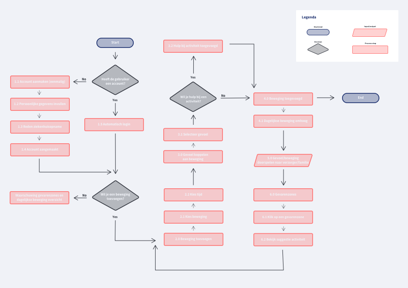
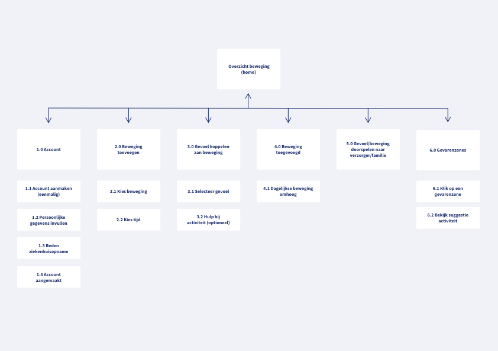
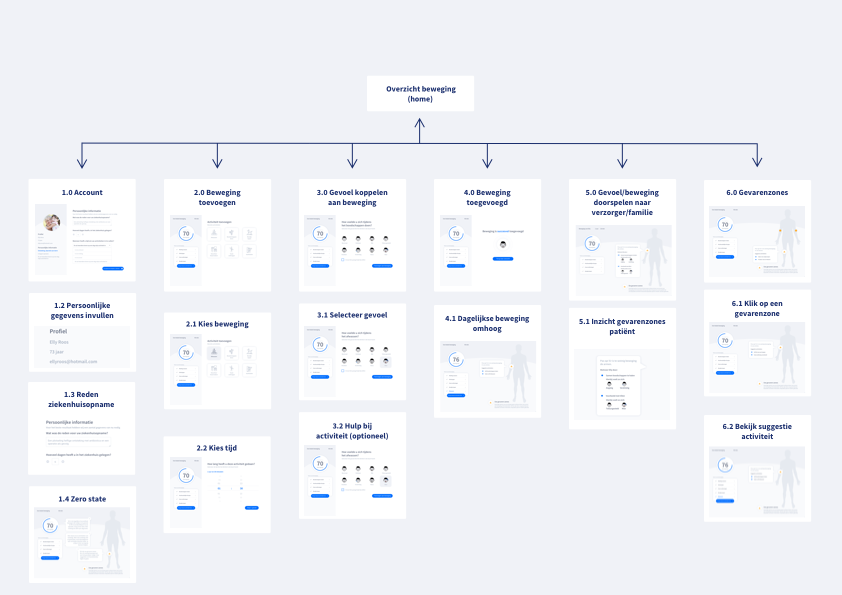

# Flow chart

Met het vak Interaction and Visualisation hebben wij gewerkt aan het uitleggen van de flow van ons concept. Dit hebben wij op drie verschillende manieren gedaan. Ten eerste door een **high-level proces flow chart** waarin je de start/end points, decisions, process en input/output kunt zien van onze oplossing. Ook is er een **screen flowchart \(level 1\)** van het [**Lo-Fi prototype 2.0**](../4.-ontwerp/lo-fi-prototype-1.0/) ****gemaakt samen met een **scherm schets \(level 2\)**. 

