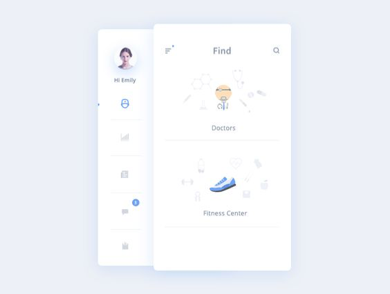
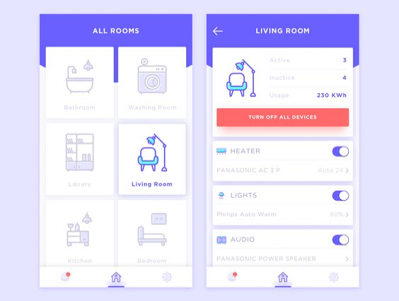
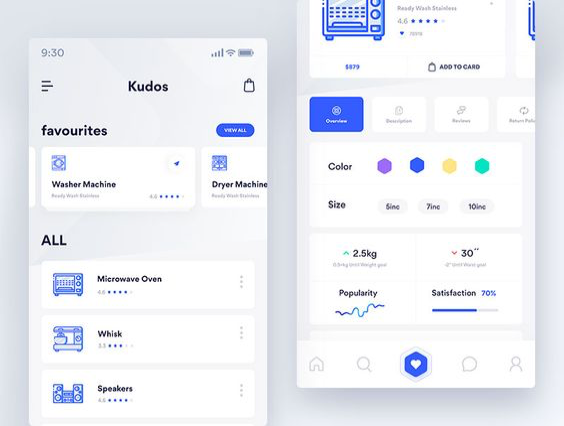
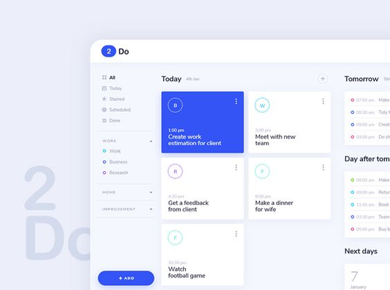
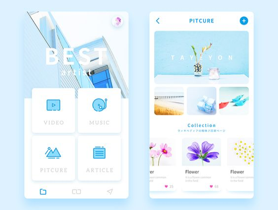
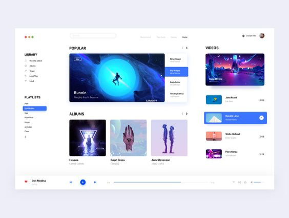

# Inspiration wall

Tijdens de idee onwikkeling fase hebben we veel inspiratie opgedaan. Hierbij hebben we vooral gekeken naar visuele elementen in medische applicaties. De belangrijkste en inzichtsvolle voorbeelden hebben wij hieronder verzameld en toegelicht. 

## Identiteit & branding

### Voorbeeld 1

In dit voorbeeld vinden wij de rust en ruimte heel erg fijn werken. Het is een hele lichte en zachte app. Het gebruik van de iconen is fijn en de blauwe kleur komt erg rustigevend over. Ook zijn we niet veel functionaliteiten waardoor het overizchtelijk blijft. Rust en overzicht is ook iets wat wij graag willen bereiken. 

### Voorbeeld 2

Dit vinden wij een goed voorbeeld van hiërarchie en kleurgebruik. De primaire actie is in deze app roze. Dit is gelijk duidelijk en daarom ook een goed voorbeeld voor onze app. Voor ouderen moet alles duidelijk zijn en moet er goed onderscheid gemaakt worden tussen kleuren. Ook heeft de iconografie in dit voorbeeld een goede hoeveelheid detail. Het is niet te abstract en ook niet te gedetailleerd. Voor ouderen met minder goede ogen zullen deze iconen waarschijnlijk goed te zien zijn. 

### Voorbeeld 3

Ook in deze app is de rust erg prettig. Ook is het fijn dat verschillende elementen van elkaar zijn afgescheiden door middel van blokken. Zo die je dat kleur en populatiteit dus tweev erschillende onderdelen zijn binnen de app. Wij willen ook goed onderscheid maken in onze app tussen elementen die juist wel, of juist niet bij elkaar horen. 

### Voorbeeld 4

In dit voorbeeld is de affordance heel erg hoog door gebruik van schuwuden. Klikbare elementen zoals een button hebben een schaduw en komen zo echt naar voren als een 3d object. Hierdoor lijkt het alsof je er echt op kan drukken zoals een knop. Voor ouderen moet het duidelijk zijn wat een knop is, wat klikbaar is en wat niet. Wij willen ook zorgen dat bijvoorbeeld klikbare cards een schaduw krijgen om te laten zien dat het klikbaar is. 

### Voorbeeld 5

In dit voorbeeld zijn de opties vrij beperkt en oogt de app simpel. Op het home scherm zijn 4 keuzes die je kunt maken om vervolgens naar een andere pagina te komen. Hier is het voor de gebruiker erg overzichtelijk en duidelijk dat ze 1 van de 4 moeten kiezen. Wij willen ook zorgen dat de gebruiker niet te veel keuze heeft en dat het simpel is om door de app heen te navigeren. 

### Voorbeeld 6

Ook in dit voorbeeld is het gebruik van kleur erg prettig. Er word op de achtergrond een witte kleur gebruikt waardoor het contrast met het blauw nog beter naar voren komt. Ook in onze app is het belangrijk dat de contrasten hoog zijn omdat ouderen minder goed zien en kleuren ook minder fel en intens zien. 

