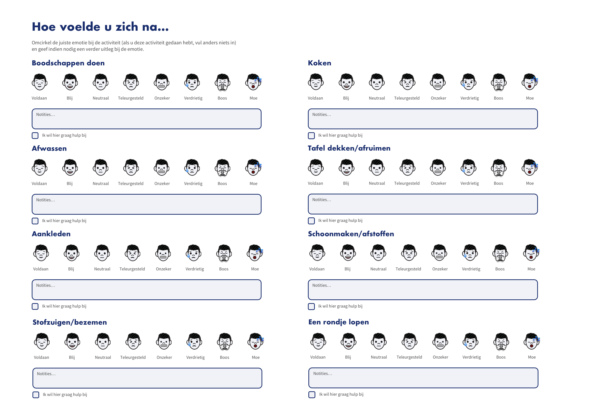
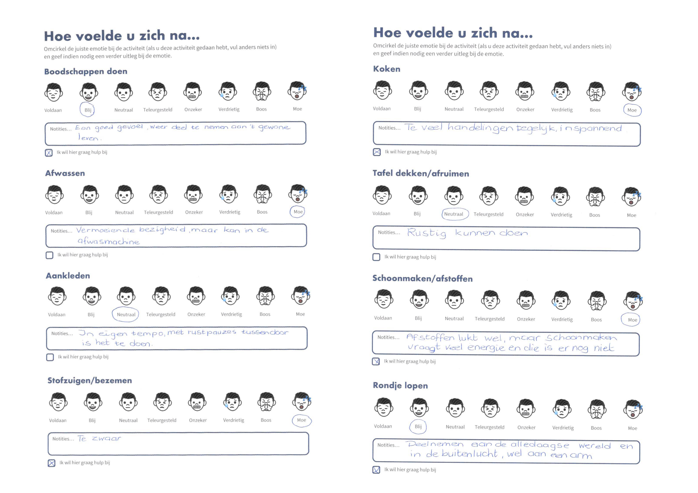

# Proof of concept

Ik heb mijn concept gevalideerd door middel van een proof of concept. Dit heb ik gedaan door middel van een proof of concept waarbij je dus een belangrijk aspect van de idee test om te kijken of het echt een goede oplossing is. 

## Voorbereiding

Voordat ik begon met het testplan van mijn proof of concept heb ik goed na gedacht welke feature van mijn oplossing ik wilde testen en op wat voor manier. Ik heb dit gedaan met de kern van mijn concept: vertellen hoe de gebruiker zich voelt bij het doen van een bepaalde activiteit en daarbij hulp vragen mocht dit nodig zijn. Ik wilde het volgende testen met mijn proof of concept:

* [ ] Vullen mensen de activiteitenlijst daadwerkelijk in?
* [ ] Hoevaak per dag pakken ze de activiteitenlijst erbij?
* [ ] Vullen ze in één keer alles in?
* [ ] Vinden ze het veel werk om de lijst in te vullen?
* [ ] Durven ze een familielid, vriend of mantelzorger om hulp te vragen als iets niet lukt?

## Testplan

Hieronder kunt u het testplan bekijken die is gebruikt bij het uitvoeren van de test. Ik heb ervoor gekozen om mijn proof of concept uit te printen en dus twee A4-tjes neer te leggen bij een relevant testpersoon. Hierdoor konden er nog geen moeilijkheden ontstaan door de keuze van het device. Hierdoor hoopte ik dat ik puur de kern kon testen en niet het type device of de interface.

## Test

De uiteindelijk test heb ik met Elly Roos gedaan. Ze was reeds ontslagen uit het ziekenhuis en heeft daar een darmoperatie gehad. Zij was voor ons een geschikt testpersoon omdat zij met haar 73 jarige leeftijd risico kan lopen op functieverlies. Omdat dit een vrij inschrijpende operatie is voor haar leeftijd is vroegtijdig mobiliseren en hulp vragen cruciaal voor het herstel.

### Details testpersoon

| Naam | Elly Roos |
| :--- | :--- |
| Leeftijd | 73 |
| Geslacht | Vrouw |
| Operatie | Darmoperatie |
| Test ingevuld | Meerdere keren per dag |
| Test invullen  | Gemakkelijk |

### Uitkomst proof of concept

## Conclusie

Na aanleiding van deze test heb ik geconcludeerd dat mijn oplossing succesvol is. De testpersoon vond het gemakkelijk om de test in te vullen en handig om stil te kunnen staan bij haar moeilijkheiden op een dag. Wat voor ons concept inzichtelijk was, is de combinatie tussen een positief gevoel en toch hulp willen. In mijn [**Lo-Fi prototype 1.0**](../design-sprint/prototype.md) had ik hier nog geen rekening mee gehouden. Dan werden alleen negatieve emoties doorgespeeld naar de familie, vrienden of mantelzorgers. In [**Lo-Fi prototype 2.0**](../../4.-ontwerp/lo-fi-prototype-1.0/) ****is het mogelijk om ook bij een postief gevoel hulp te vragen. 

